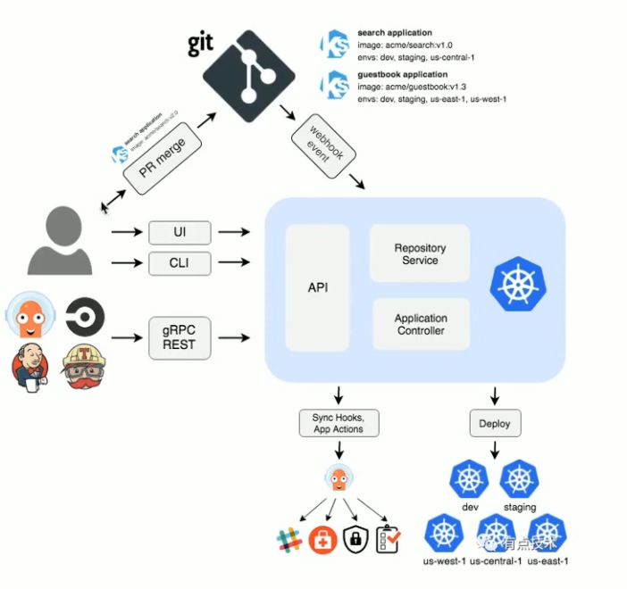

# argocd
Argo CD是用于Kubernetes的声明性GitOps连续交付工具。

## 为什么选择Argo CD？
* 应用程序定义，配置和环境应为声明性的，并受版本控制。
* 应用程序部署和生命周期管理应该是自动化的，可申核的且易于理解的。

## argocd 架构
* Argo CD被实现为kubernetes控制器，该控制器连续监视正在运行的应用程序，并将当前的活动状态与所需的目标状态（在Git存储库中指定）进行比较。
* 其活动状态偏离目标状态的已部署应用程序被标记为OutOfSync.
* Argo CD报告并可视化差异，同时提供了自动或手动将实时状态同步回所需目标状态的功能。
* 在Git存储库中对所需目标状态所做的任何修改都可以自动应用并反映在指定的目标环境中。



## argocd 安装
```bash
kubectl create namespace argocd
kubectl apply -n argocd -f https://raw.githubusercontent.com/argoproj/argo-cd/stable/manifests/install.yaml
```

argocd [demo](https://www.digitalocean.com/community/tutorials/how-to-deploy-to-kubernetes-using-argo-cd-and-gitops)
