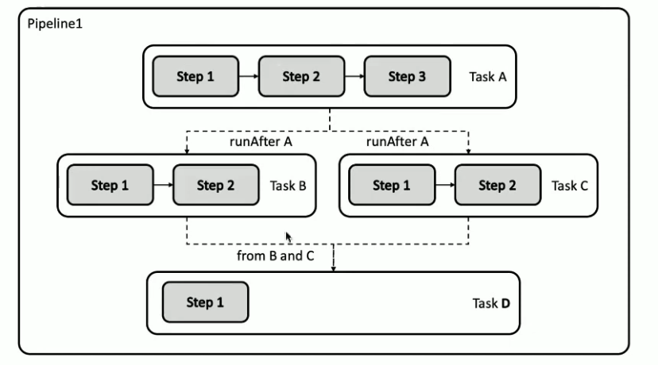
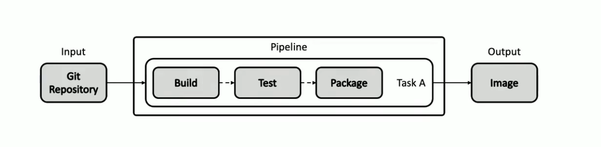

### 基于声明式API的流水线-Tekton
* 自定义：Tekton对象是高度自定义的，可扩展性极强。平台工程师可预定义可重用模块以详细的模块目录提供，开发人员可在其他项目中直接引用。
* 可重用：Tekton对象的可重用性强，组件只需一次定义，即可被组织内的任何人在任何流水线都可重用。使得开发人员无需重复造轮子即可构建复杂流水线。
* 可扩展性：Tekton组件目录（Tekton Catalog）是一个社区驱动的Tekton组件的存储仓库。任付用户司以直接以社区缺取成款的组件并在此之上构建复茶济水线，也就是当你曼沟建一个济水线时，很可能你需要的所有代码和配置都可以从Tekton Cataiog直接拿下来复用，而无需重复
开发。
* 标准化：Tekton作为Kubernetes集群的扩展安装和运行，并使用业界公认的Kubernetes资源
模型；Tekton作业以Kubernetes容器形态执行。
* 规模化支持：只需增加Kubernetes节点，即可增加作业处理能力。Tekton的能力可依照集群规模随意扩充，无需重新定义资源分配需求或者重新定义流水线。

### Tekton核心组件
* Pipeline ：对象定义了一个流水线作业，一个Pipeline对象由一个或数个Task对象组成。
* Task ：一个可独立运行的任务，如获取代码，编译，或者推送镜像等等，当流水线被运行时，kubernetes会为每个Task创建一个Pod。个Task由多个Step组成，每个Step体现为这个Pod中的一个容器。

### 输入输出资源
Pipeline和Task对象可以接收git reposity, pull request等资源作为输入，可以将Image，Kubernetes Cluster, Storage, CioudEvent等对象作为输出。

