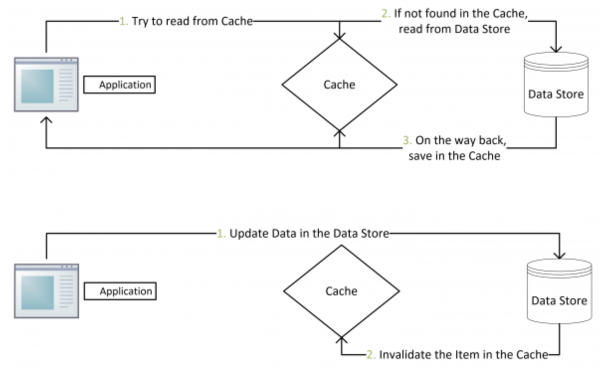
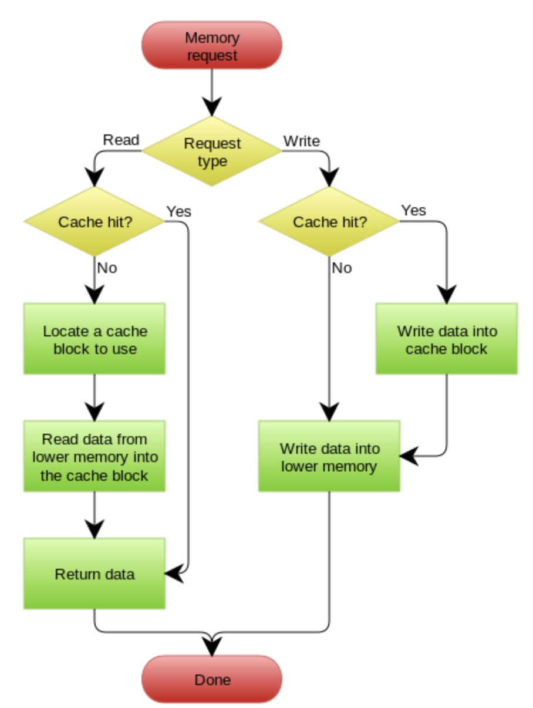
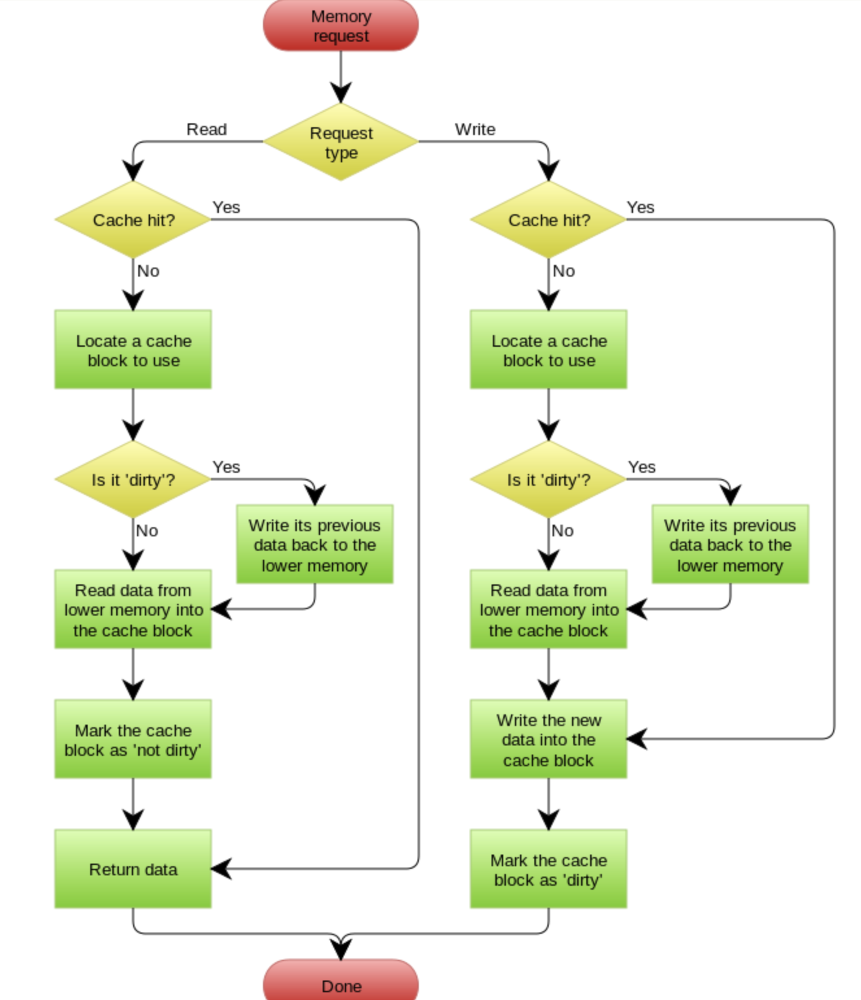

# Cache

## 目录

## [缓存更新的套路](https://coolshell.org/articles/17416.html/)

### Cache Aside Pattern

- **失效**: 应用程序先从cache取数据，没有得到，则从数据库中取数据，成功后，放到缓存中。
- **命中**: 应用程序从cache中取数据，取到后返回。
- **更新**: 先把数据存到数据库中，成功后，再让缓存失效。

### Read/Write Through Pattern

Read/Write Through套路是把更新数据库（Repository）的操作由缓存自己代理了，所以，对于应用层来说，就简单很多了。可以理解为，应用认为后端就是一个单一的存储，而存储自己维护自己的Cache。

#### Read Through

Read Through 套路就是在查询操作中更新缓存，也就是说，当缓存失效的时候（过期或LRU换出），Cache Aside是由调用方负责把数据加载入缓存，而Read Through则用缓存服务自己来加载，从而对应用方是透明的。

#### Write Through

Write Through 套路和Read Through相仿，不过是在更新数据时发生。当有数据更新的时候，如果没有命中缓存，直接更新数据库，然后返回。如果命中了缓存，则更新缓存，然后再由Cache自己更新数据库（这是一个同步操作）。

### Write Behind Caching Pattern

Write Back套路，一句说就是，在更新数据的时候，只更新缓存，不更新数据库，而我们的缓存会异步地批量更新数据库。这个设计的好处就是让数据的I/O操作飞快无比（因为直接操作内存嘛 ），因为异步，write backg还可以合并对同一个数据的多次操作，所以性能的提高是相当可观的。

