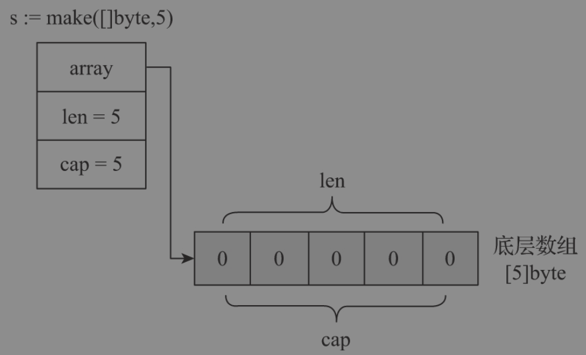
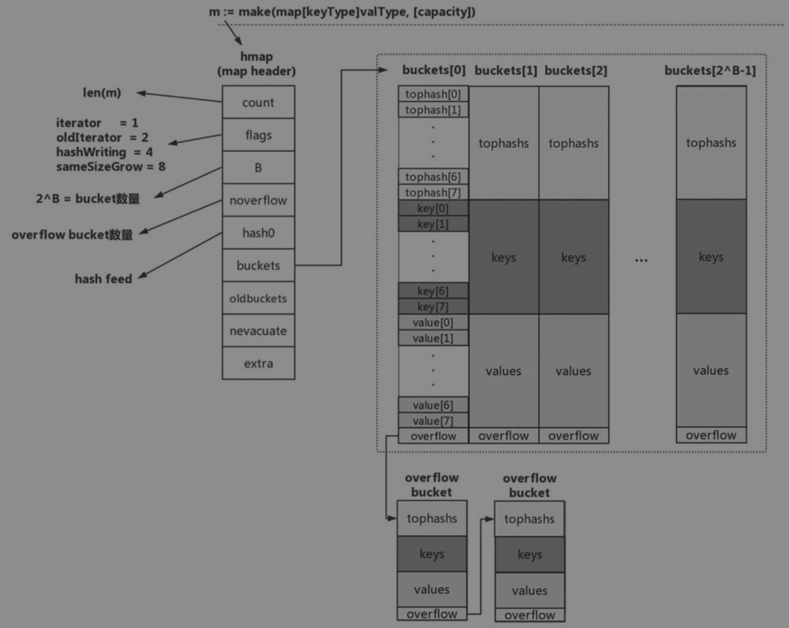
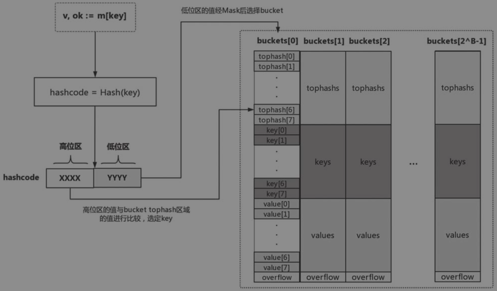
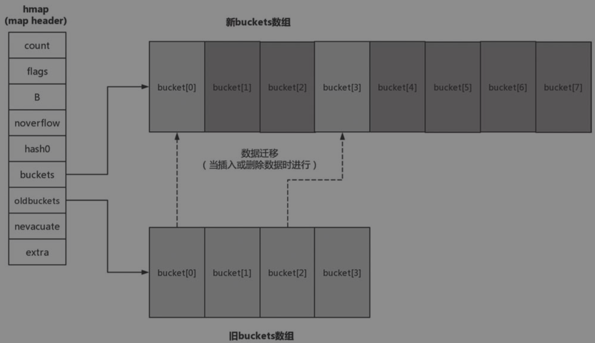

### Go 是传值还是传引用？
Go中的所有东西都是以值传递的

### Golang 相对于其他语言有哪些特点：
* 编译高效
* 支持高并发，对多核计算机支持友好
* 支持垃圾回收
* 不支持继承

### new 和 make 是什么，差异在哪？
在 Go 语言中，内置函数 make 仅支持 slice、map、channel 三种数据类型的内存创建，其返回值是所创建类型的本身，而不是新的指针引用。

```go
func make(t Type, size ...IntegerType) Type
```
在 Go 语言中，内置函数 new 可以对类型进行内存创建和初始化。其返回值是所创建类型的指针引用，与 make 函数在实质细节上存在区别。

```go
func new(Type) *Type
```
new 函数在日常工程代码中是比较少见的，因为他可被替代。一般会直接用快捷的 T{} 来进行初始化，因为常规的结构体都会带有结构体的字面属性。
本质上在于 make 函数在初始化时，会初始化 slice、chan、map 类型的内部数据结构，new 函数并不会。
例如：在 map 类型中，合理的长度（len）和容量（cap）可以提高效率和减少开销。

### interface的实现原理
Go语言中的接口是一种类型，一种抽象的类型。它是一组方法签名的集合，只要某个对象实现了某个接口的所有方法，那么就说这个对象实现了这个接口, 也常称其为鸭子类型（Duck typing）。
接口的底层数据机构在运行时分为两类结构体：
* runtime.eface：表示空接口，包含两个字段：type和data，其中type表示接口的具体类型，data表示接口的具体值。
* runtime.iface：表示非空接口，包含三个字段：tab、type和data，其中tab表示接口的方法集，type表示接口的具体类型，data表示接口的具体值。

#### runtime.eface
```go
type eface struct {
    _type *_type
    data  unsafe.Pointer
}
```

#### runtime.iface
```go
type iface struct {
    tab  *itab
    data unsafe.Pointer
}

type itab struct {
    inter *interfacetype
    _type *_type
    hash  uint32 // copy of _type.hash. Used for type switches.
    _     [4]byte
    fun   [1]uintptr // variable sized. fun[0]==0 means _type does not implement inter.
}
```

#### 值接收者和指针接收者的区别
* 值接收者：调用方法时，会将接收者的值进行拷贝，然后再进行方法调用，因此在方法内部无法修改接收者的值。
* 指针接收者：调用方法时，会将接收者的值的地址进行拷贝，然后再进行方法调用，因此在方法内部可以修改接收者的值。

使用： 如果我们实现了一个值对象的接收者时，也会相应拥有了一个指针接收者。两者并不会互相影响，因为值对象会产生值拷贝，对象会独立开来。而指针对象的接收者不行，因为指针引用的对象，在应用上是期望能够直接对源接收者的值进行修改，若又支持值接收者，显然是不符合其语义的。

#### 类型断言
```go
var x interface{} = 1
v, ok := x.(int)
```

```go
var i interface{} = "hello"
switch v := i.(type) {
case int:
    fmt.Printf("Twice %v is %v\n", v, v*2)
case string:
    fmt.Printf("%q is %v bytes long\n", v, len(v))
case nil:
    fmt.Println("x is nil")
default:
    fmt.Println("I don't know about type %T!\n", v)
}
```
### string的实现原理
string在Go中是一种值类型，即每个字符串都是不可变的，一旦创建就不能被修改。

在Go语言中，字符串类型是通过一个结构体来实现的。这个结构体包含两个字段：指向字符串数据的指针和字符串的长度。这个结构体的定义如下:

```go
type string struct {
    str unsafe.Pointer
    len int
}
```
字符串通常以UTF-8编码进行存储，编译器会尝试将字符串转换为字节数组来提高程序的性能。

### slice的实现原理
是数组的“描述符”，包含指向底层数组的指针，能避免在函数参数传递时避免较大的性能损失。此外，还支持动态扩容。
```go
type slice struct {
    array unsafe.Pointer
    len   int
    cap   int
}
```

#### slice的扩容
Go语言中的切片是一种动态数组，其底层是一个数组，切片的容量是可以动态增长的，当切片的容量不足以存储新的元素时，切片会自动扩容，扩容后的容量为之前容量的两倍。当切片的容量达到一定程度后，切片的扩容策略会发生变化，扩容后的容量为之前容量的1.25倍。

### map的现实原理
Go 语言中的 Map 是一种哈希表实现的无序键值对集合，底层使用了散列表。Map 内部由一个桶数组和对应的哈希函数组成，每个桶包含一个指向键值对链表的指针。在 Map 中添加、查找和删除键值对时，会根据键的哈希值计算对应的桶的索引，并在该桶的链表中进行操作。为了减少哈希冲突，Go 语言中的 Map 使用了链表式开放寻址法的解决方案。

#### map的内部实现


hashcode:


#### map的扩容
Go运行时的map实现中引入了一个LoadFactor（负载因子），当count >LoadFactor * 2^B或overflow bucket过多时，运行时会对map进行扩容。目前LoadFactor设置为6.5（loadFactorNum/loadFactorDen）。

如果是因为overflow bucket过多导致的“扩容”，实际上运行时会新建一个和现有规模一样的bucket数组，然后在进行assign和delete操作时进行排空和迁移；如果是因为当前数据数量超出LoadFactor指定的水位的情况，那么运行时会建立一个两倍于现有规模的bucket数组，但真正的排空和迁移工作也是在进行assign和delete操作时逐步进行的。原bucket数组会挂在hmap的oldbuckets指针下面，直到原buckets数组中所有数据都迁移到新数组，原buckets数组才会被释放。


### map并发安全吗 
map不是并发安全的，map并没有对并发场景进行优化，并发读写是使用map时常见的错误, 如果多个goroutine同时访问一个map，就会出现并发问题，需要加锁保护。三种线程安全的map: 

* 加读写锁；
* 加分片锁；
* 使用sync.map(Go 1.9+)

### Init()函数的作用
在main函数执行之前，会先执行init函数，init函数可以用来初始化一些变量，比如初始化一些配置文件，或者是初始化一些数据库连接等等。

程序初始化顺序：

Go运行时会根据包导入的顺序，依次初始化main包的依赖包，且Go运行时按照“深度优先”原则查看依赖包，在每个包中按照: 常量— 变量 — init函数的顺序进行初始化。

### 进程、线程和协程的定义
* 进程：分配系统资源（CPU时间，内存, I/O等）的基本单位；有独立的内存空间，切换开销大。
* 线程：进程的一个执行流，是CPU调度并能独立运行的基本单位。同一进程中的多线程共享内存空间，线程切换代价小；多线程通信方便；从内核层面来看线程其实也是一种特殊的进程，它跟父进程共享了打开的文件和文件系统信息，地址空间和信号处理函数。
* 协程：Go语言中的一种轻量级线程，也可以称为是用户态的线程，与内核态的线程不同，协程由Go语言运行时管理，不是由操作系统内核调度，从而协程上下文切换代价较小，同时协程占用资源小，每个协程的初始栈大小为2kb左右。

Go在runtime、系统调用等多个方面对goroutine调度进行了封装和处理，当遇到长时间执行或者进行系统调用时，会主动把当前goroutine的CPU(P)转让出去，让其他goroutine能被调度并执行，从语言层面支持了协程。

### 线程和协程的差异
* 占用资源小，每个协程的初始栈大小仅为2KB。远比java, C 的线程少：goroutine(2KB), 线程（8MB）
* 由Go运行时而不是操作系统调度，goroutine上下文切换代价较小。线程/协程切换开销方面，协程远比线程小：线程涉及模式切换（从用户态切换到内核态）、16个寄存器、PC、SP… 等寄存器的刷新；协程只涉及三个寄存器的值的修改 - PC / SP / DX

### 什么是goroutine
goroutine 是由Go 运行时管理的用户层轻量级线程
status of Goroutine:

* runnable
* running
* syscall
* waiting

[go11sched](https://golang.org/s/go11sched)

G: goroutine

P: processor, a resource that is required to execute Go code. M must have an associated P to execute Go code, however it can be blocked or in a syscall w/o an associated P.

M: worker thread

G-P-M模型是实现Goroutine调度器的基础，在这基础之上还实现了抢占式调度。以解决 一旦某个G中出现死循环，G将永久占用分配给它的P和M，而位于同一个P中的其他G将得不到调度，出现“饿死”的情况。

[golang-runtime-scheduler](https://colobu.com/2017/05/04/golang-runtime-scheduler/)

### 什么是channel
channel是Go语言中的一种类型，它是一种引用类型，类似于一个管道，用于goroutine之间的通信。channel是一种特殊的类型，只能用于通信，不能用于其他用途。channel是一种引用类型，channel的零值是nil，channel必须使用make函数初始化后才能使用。

channel的实现原理基于CSP（Communicating Sequential Processes）模型

channel 类似Unix的Pipe，用于协程之间的通信和同步；协程之间虽然解偶，但是它们和channel有着偶合。

### go gc的工作原理
Go语言的垃圾回收器是一个三色标记清除的并发收集器. 三色标记清除的工作原理是：从根变量开始遍历所用的对象，引用的对象标记为“被引用”，没有被标记的进行回收。
标记-清除：从根变量开始遍历所用的对象，引用的对象标记为“被引用”，没有被标记的进行回收
缺点：需要STW（stop the word）, 即要暂停程序运行

### 垃圾回收触发机制
* 内存分配量达到阀值触发GC：每次内存分配时都会检查当前内存分配量是否已达到阀值，如果达到阀值就启动GC，阀值 = 上次GC内存分配量 * 内存增长率（由环境变量GOGC控制，default 100, 即每当内存扩大一倍时启动GC）
* 定期触发GC
* 手动触发

### 堆内存分配的挑战
Thread-Cache Malloc: 线程缓存分配

* 对象大小： Go的内存分配器会根据申请分配的内存大小选择不同的处理逻辑，运行时根据对象的大小将对象分成微对象，小对象，大对象。
* 多级缓存：内存分配器不仅会区别对待大小不同的对象，还会将内存分配成不同的级别分别管理：
    * Thread Cache
    * Central Cache
    * Page Heap
* 多级申请内存
* 规划内存

### TC Malloc：
堆内存预分配：每个线程维护各自的私有内存空间，防止多线程竞争。

### 导致Channel泄漏的原因
* channel 使用不当
* 慢等待
* 互斥锁忘记解锁
* 同步锁使用不当

### Go 内存逃逸
[link](https://segmentfault.com/a/1190000040450335)
#### 什么是内存逃逸
在一段程序代码中，每个函数都有自己的内存区域存放自己的局部变量、返回地址等，这些内存会由编译器在 **栈(Stack)** 中进行分配，每个函数都会分配一个栈帧，在函数运行结束后销毁，但有些变量我们想在函数运行结束后仍然使用，那么就需要把这个变量在 **堆(Heap)** 上分配，这种从“栈”上逃逸到“堆”上的现象就是内存逃逸。

#### 什么是逃逸分析
逃逸分析就是指程序在编译阶段根据代码中的数据流，对代码中哪些变量需要在栈中分配，哪些变量需要在堆上分配进行静态分析的方法。

#### Go 中的逃逸分析
source code: `/usr/local/go/src/cmd/compile/internal/escape/escape.go`

```go
// Escape analysis.
//
// Here we analyze functions to determine which Go variables
// (including implicit allocations such as calls to "new" or "make",
// composite literals, etc.) can be allocated on the stack. The two
// key invariants we have to ensure are: 
// (1) pointers to stack objects cannot be stored in the heap, and 
// (2) pointers to a stack object
// cannot outlive that object (e.g., because the declaring function
// returned and destroyed the object's stack frame, or its space is
// reused across loop iterations for logically distinct variables).
//
```

##### 产生逃逸的场景
- 函数返回局部指针变量
- interface类型逃逸
- 闭包产生的逃逸
- 变量大小不确定及栈空间不足引发逃逸


### 导致panic的场景
* Out of Bounds Panics
* When a division by zero occurs
* Nil Receivers

### Go Context的作用

### 设计个消息队列

### 实现超时取消

### 什么时候用Var, 什么时候用 new/make申明变量
