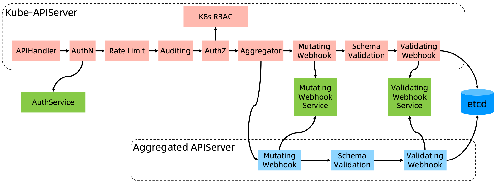
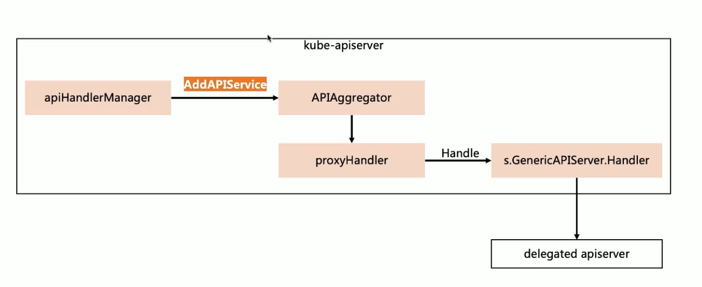
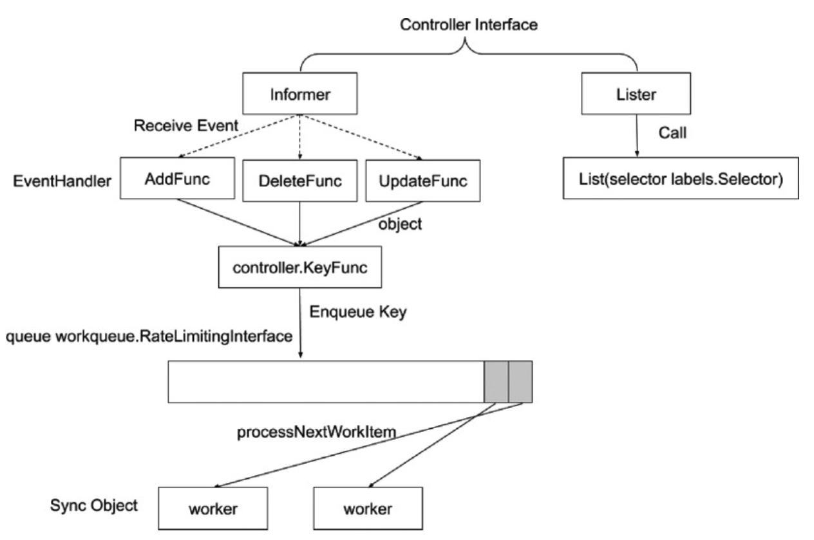
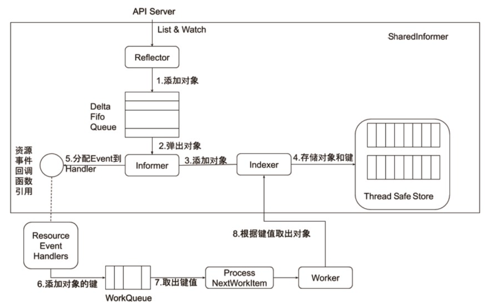
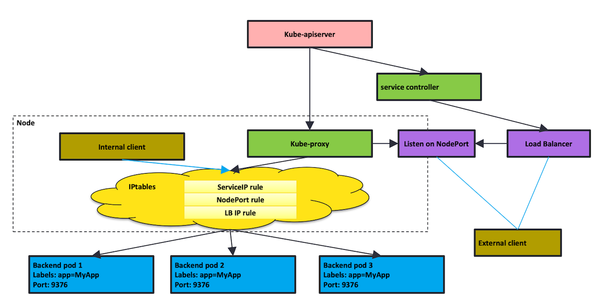
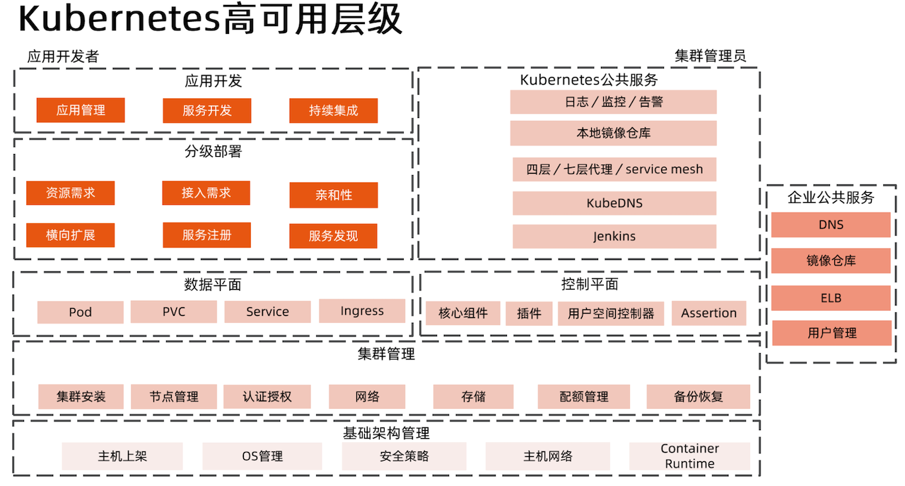
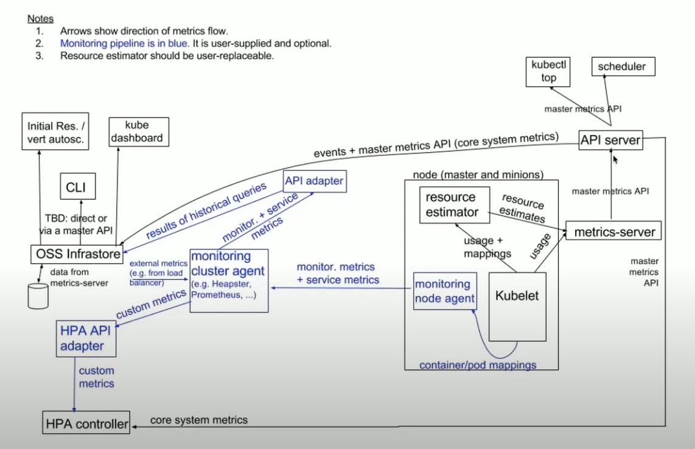

## Kubernetes Components
There are five main components in kubernetes cluster, included "API Server", "Controller Manager", "Scheduler", "Kubelet" and "Kube-Proxy", and storage is "ETCD".
### API Server
API Server 提供集群管理的 REST API 接口, 包括：认证(Authentication)，授权(Authorization)，准入Admission(Mutating & Valiating)。其他模块通过API Server查询或修改数据，只有APIServer才直接操作etcd。APIServer 提供 etcd 数据缓存以减少集群对 etcd 的访问。

API Server展开


#### Aggregated APIServer

### Controller Manager
Controller Manager 是一个控制器的集合，负责管理集群中的各种资源，确保Kubernetes遵循声明式系统规范，确保系统的真实状态（Actual State）与用户定义的期望状态（Desired State）一致。

控制器的工作流程：


Informer工作机制：

### Scheduler
Scheduler 负责将 Pod 调度到合适的节点上，调度的策略是通过 Scheduler Policy 配置的，可以通过 Scheduler Policy 配置 Pod 的优先级，以及 Pod 调度的策略。

1. 调度阶段：

  * Predict
  * Prioritize
  * Bind
 
### Kubelet
Kubelet 是 Kubernetes 中的 Agent，负责管理 Pod 的生命周期，包括创建、启动、停止、删除 Pod，以及 Pod 的健康检查, 并负责汇报当前节点的资源信息和健康状态。
#### CNI
Kubernetes网络模型设计的基础原则是：

* 所有Pod能够不通过NAT就能相互访问
* 所有节点能够不通过NAT就能相互访问
* 容器内看到的IP地址和外部组件看到的容器IP是一样的
### Kube-Proxy
Kube-Proxy 是 Kubernetes 中的网络代理，负责实现 Kubernetes Service 的网络代理功能，包括负载均衡、服务发现等。

每台机器上都运行一个kube-proxy服务，它监听API Server中的Service和Endpoint的变化情况，并通过iptables等来为服务配置负载均衡（仅支持TCP和UDP）。

Kube-Proxy原理：

## Kubernetes HA Levels

## Service
### Service类型

* ClusterIP: 默认类型，服务被发布至仅集群内部可见的虚拟IP地址上（service-cluster-ip-range）
* NodePort: 在API Server启动时，需要通过service-node-port-range参数配置nodePort的范围，同样的，API Server会捕获Service对象并创建事件，即从配置好的nodePort范围取一个有效端口，分配给该Service。每个节点的kube-proxy会尝试在服务分配的nodePort上建立侦听器接受请求，并转发给服务对应的后端Pod实例。
* LoadBalancer: 采用外部的负载均衡器，作为外网请求进入数据中心内部的统一流量入口，针对不同的云平台，Kubernetes Cloud Manager提供支持不同供应商API的Service Controller。

## CoreDNS
CoreDNS包含一个内存态DNS，以及与其他controller类似的控制器。

CoreDNS实现原理：控制器监听Service和Endpoint的变化并配置DNS，客户端Pod在进行域名解析时，从CoreDNS中查询服务对应的地址记录。

Check DNS in a Pod: ```cat /etc/resolv.conf```

```
[root@initial-delay /]# 
nameserver 10.96.0.10
search default.svc.cluster.local svc.cluster.local cluster.local
options ndots:5
```
## Pod优雅终止

## Metrics Server
metrics-server是Kubernetes监控体系中的核心组件之一，它负责从Kubelet收集资源指标，然后对这些指标监控数据进行聚合（依赖kube-aggregator的），并在Kubernetes APIServer 中通过Metrics API(/apis/metrics.k8s.io/)公开暴露它们，但是metrics-server只存储最新的指标数据(CPU/Memory)。

*  kube-apiserver要能访问到metrics-server, 需要kube-apiserver启用聚合层。
*  组件要有认证配置并且绑定到metrics-server。
*  Pod/Node指标需要由Summary API通过Kubelet公开。

### Monitoring Architecture


### CNI
