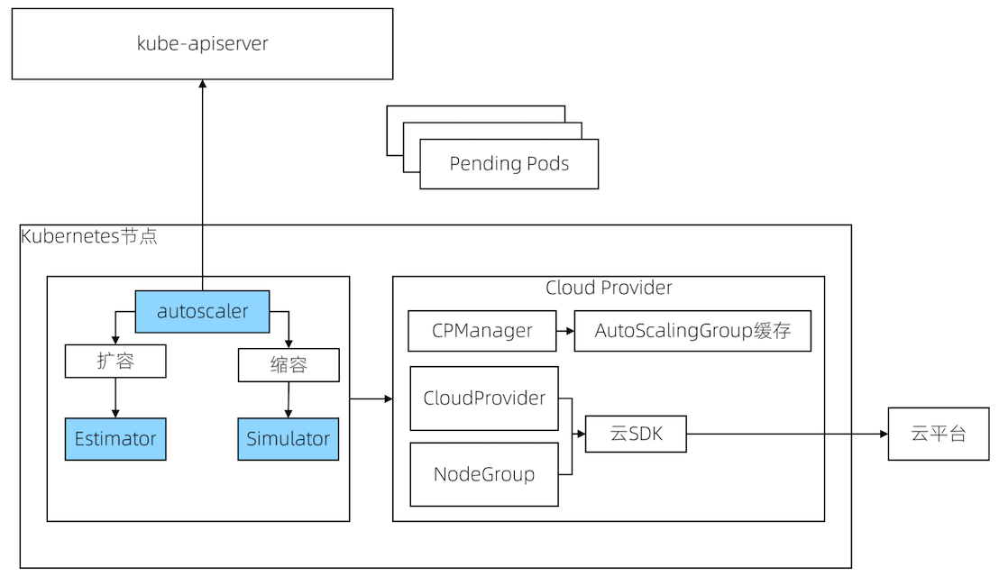

## 工作机制
* 扩容：
  - 由于资源不足，pod调度失败，即pod一直处于Pending状态
* 缩容：
  - node的资源利用率较低时，持续10分钟低于50%
  - 此node上存在的pod都能被重新调度到其他node上
## Cluster Autoscaler架构
* AutoScaler: 核心模块，负责整体扩缩容功能
* Estimator: 负责评估计算扩容节点 
* Simulator：负责模拟调度，计算缩容节点
* Cloud-Provider：与云交互进行节点的增删操作

Cluster Autosacler架构：

