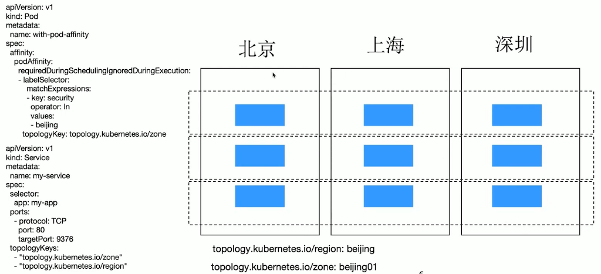
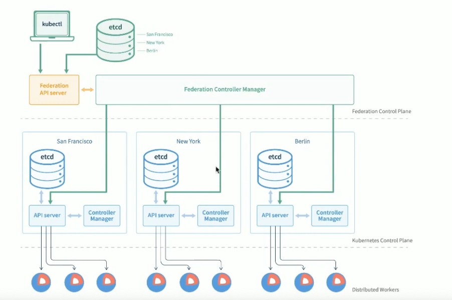
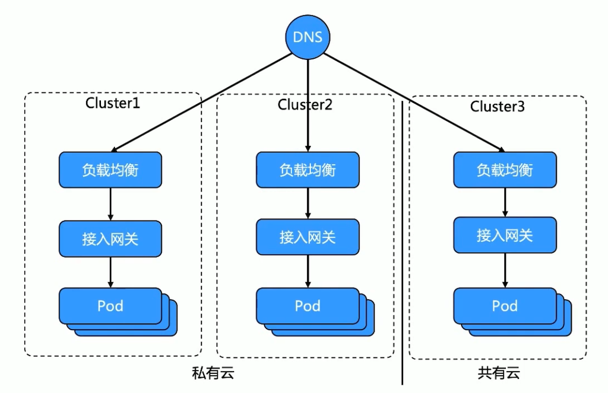
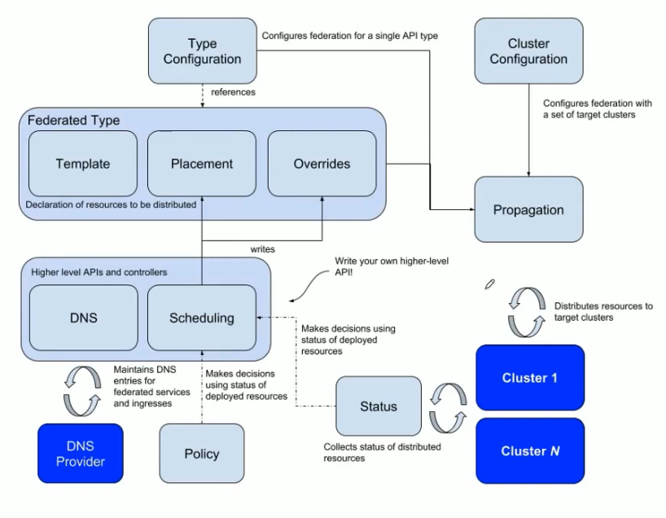

# Kubernetes集群联邦和Istio多集群管理

## 多集群治理的驱动力
分布式云是未来
* 成本优化 (Cost Effective)
* 更好的弹性及灵活性 (Elasticity & Flexibility)
* 避免厂商锁定 (Avoid Vendor Lock-in)
* 第一时间获取云上的新功能 (Innovation)
* 容灾 (Resilience & Recovery)
* 数据保护及风险管理 (Data Protection & Risk Management)
* 提升相应速度 (Network Performance Improvements)

分布式云的挑战
* Kubernetes单集群承载能力有限
* 异构的基础设施
* 存量资源接入
* 配置变更及下发
* 跨地域，跨机房应用部署及管理
* 容灾与隔离性，异地多活
* 弹性调度及自动伸缩
* 监控告警

如何应对
* 通过Kubernetes屏蔽底层基础设施，提供统一的接入层
* 多云架构
  * 多集群 != 多云
  * 多集群管控
* 统一的管控面
* 方便接入，降低门槛

跨地域的集群管理

## 集群联邦
### 必要性：
* 单一集群的管理规模有上限
  * 数据库存储
    * etcd 作为Kubernetes 集群的后端存储数据库 ，对空间大小的要求比较苛刻，这限制了集群能存储的对象数量和大小。
  * 内存占用
    * 为提高系统效率，Kubernetes 的 API Server 作为 API 网关，会对该集群的所有对象做缓存。集群越大，缓存需要的内存空间就越大。
    * 其他 Kubernetes 控制器也需要对侦听的对象构建客户端缓存，这些都需要占用系统内存。这些内存需求都要求对系统的规模有所限制。
  * 控制器复杂度
    * Kubernetes的一个业务流程是由多个对象和控制器联动完成的，，即使控制器遵循了设计原则，随着对象数量的增长，控制器的处理耗时也会越来越长。
* 单个计算节点资源上限
  * 单个计算节点的资源，不仅仅是 CPU、内存等可量化资源。
  * 还有端口、进程数量等不可量化资源。比如 Linux 支持的TCP 端口上限是 65535，去除常用端口和程序源端口后，留给 Service nodePort 的端口数量是有限的，这限制了集群支持的Service 的数量。
* 故障域控制
  * 集群规模越大，控制平面组件出现故障时的影响范围就越大。为了更好地控制故障域（FaultDomain），需要将大规模的数据中心切分成多个规模相对较小的集群，每个集群控制在一定规模。
* 应用高可用部署
  * 生产应用通常需要多数据中心部署来保障跨地域高可用，以确保当其中一个数据中心出现故障，或者集群做技术迭代更新时，其他数据中心可以继续提供服务。
* 混合云
  * 私有云加公有云的混合云模式逐渐成为企业的主流架构。

### 职责
* 跨集群同步资源
  * 联邦可以将资源同步到多个集群并协调资源的分配。例如，联邦可以保证一个应用的 Deployment被部署到多个集群中，同时能够多满足全局的调度策略。
* 跨集群服务发现
  * 联邦汇总各个集群的服务和 Ingress，并暴露到全局 DNS 服务中。
* 高可用
  * 联邦可以动态地调整每个集群的应用实例，旦隐藏了具体的集群信息。
* 避免厂商锁定
  * 每个集群都是部署在真实的硬件或云供应商提供的硬件（或虚拟硬件）之上的，若要更换供应商，只需在新供应商提供的硬件上部署新的集群，并加入联邦。联邦可以几乎透明地将应用从原集群迁移到新集群而无须对应用做更改。

### 混合云

### 集群联邦
* 集群联邦（Federation ）是将多个Kubernetes 集群注册到统一控制平面，为用户提供统一 API 入口的多集群解决方案。
* 集群联邦设计的核心是提供在全局层面对应用的描述能力，并将联邦对象实例化为 Kubernetes 对象，分发到联邦下辖的各个成员集群中。

### 基于集群联邦的高可用应用部署

### 集群联邦的架构
* etcd作为分布式存储后端存储所有对象；
* API Server 作为 API 网关，接收所有来自用户及控制平面组件的请求；
* 不同的控制器对联邦层面的对象进行管理、协调等；
* 调度控制器在联邦层面对应用进行调度、分配。
* 集群联邦支持灵活的对象扩展，允许将基本Kubernetes 对象扩展为集群联邦对象，并通过统一的联邦控制器推送和收集状态。

### 集群联邦管理的对象
* 成员集群是联邦的基本管理单元，所有待管理集群均须注册到集群联邦。
* 集群联邦 V2 提供了统一的工具集（Kubefedctl），允许用户对单个对象动态地创建联邦对象。动态对象的生成基于CRD。

### 集群注册中心：
* 集群注册中心（ClusterRegistry,）提供了所有联邦下辖的集群清单，以及每个集群的认证信息、状态信息等。
* 集群联邦本身不提供算力，它只承担多集群的协调工作，所有被管理的集群都应注册到集群联邦中。
* 集群联邦使用了单独的 KubeFedCluster 对象（同样适用 CRD 来定义）来管理集群注册信息：
  * 在该对象的定义中，不仅包含集群的注册信息，还包含集群的认证信息的引用，以明确每个集群使用的认证信息；
  * 该对象还包含各个集群的健康状态、域名等；
  * 当控制器行为出现异常时，直接通过集群状态信息即可获知控制器异常的原因。
## Clusternet
## Istio多集群管理

