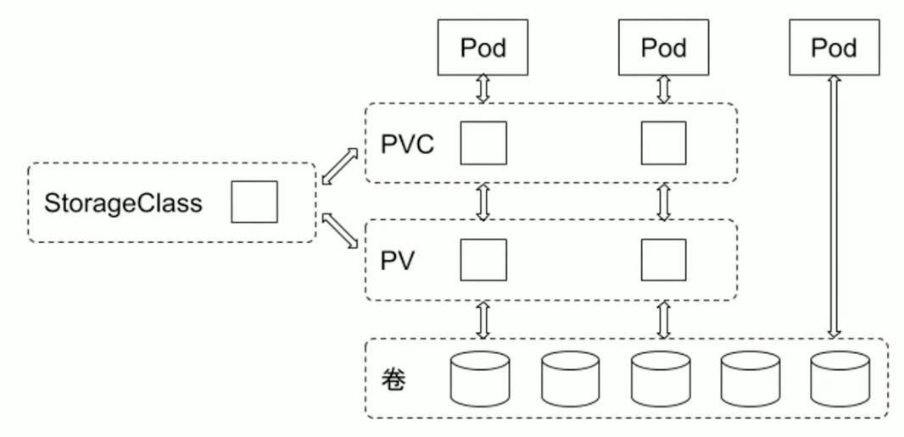
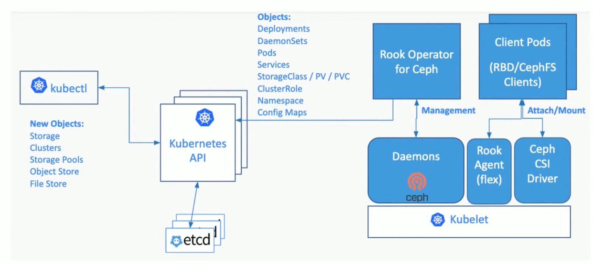

# CSI

## Storage Objects
### StorageClass
StorageClass 用于指示存储的类型，不同的存储类型可以通过不同的 StorageClass 来为用户提供服务。
StorageClass 主要包含存储插件 provisioner、卷的创建和mount 参数等字段。

```YAML
apiVersion: storage.k8s.io/v1
kind: StorageClass
metadata:
  name: rook-ceph-block
provisioner: rook-ceph.rbd.csi.ceph.com
parameters:
  # clusterID is the namespace where the rook cluster is running
  clusterID: rook-ceph # namespace:cluster
  pool: replicapool
  # RBD image format. Defaults to "2".
  imageFormat: "2"
  imageFeatures: layering
  # The secrets contain Ceph admin credentials. These are generated automatically by the operator
  # in the same namespace as the cluster.
  csi.storage.k8s.io/provisioner-secret-name: rook-csi-rbd-provisioner
  csi.storage.k8s.io/provisioner-secret-namespace: rook-ceph # namespace:cluster
  csi.storage.k8s.io/controller-expand-secret-name: rook-csi-rbd-provisioner
  csi.storage.k8s.io/controller-expand-secret-namespace: rook-ceph # namespace:cluster
  csi.storage.k8s.io/node-stage-secret-name: rook-csi-rbd-node
  csi.storage.k8s.io/node-stage-secret-namespace: rook-ceph # namespace:cluster
  # Specify the filesystem type of the volume. If not specified, csi-provisioner
  # will set default as `ext4`. Note that `xfs` is not recommended due to potential deadlock
  # in hyperconverged settings where the volume is mounted on the same node as the osds.
  csi.storage.k8s.io/fstype: ext4
allowVolumeExpansion: true
reclaimPolicy: Delete
```

### PVC
由用户创建，代表用户对存储需求的声明，主要包含需要的存储大小，存储卷的访问模式、StroageClass 等类型，其中存储卷的访问模式必须与存储的类型一致.
### PV
由集群管理员提前创建 ，或者根据 PVC 的申请需求动态地创建 ，它代表系统后端的真实的存储空间，可以称之为卷空间。

### 存储对象关系
用户通过创建 PVC 来申请存储。控制器通过 PVC 的 StorageClass 和请求的大小声明来存储后端创
建卷，进而创建 PV，Pod 通过指定 PVC 来号1用存储。


## Rook
Rook 是一款云原生环境下的开源分布式存储编排系统，目前支持 Ceph、 NFS、 EdgeFS、Cassandra、CockroachDB 等存储系统。它实现了一个自动管理的、自动扩容的、自动修复的分布
式存储服务。Rook 支持自动部署、启动、配置、分配、扩容/缩容、升级、迁移、灾难恢复、监控
以及资源管理。
### Rook架构

#### Rook Operator
Rook Operater 是Rook 的大脑，以deployment 形式存在。
其利用 Kubernetes 的 controller-runtime 框架实现了CRD，并进而接受 Kubernetes 创建资源的请求并创建相关资源（集群，pool，块存储服务，文件存储服务等）。
Rook Operater 监控存储守护进程 ，来确保存储集群的健康。
监听 Rook Discovers 收集到的存储磁盘设备，并创建相应服务（Ceph 的话就是 OSD了）。 
#### Rook Discover
Rook Discover 是以 Daemonset 形式部署在所有的存储机上的，其检测挂接到存储节点上的存储设备。把符合要求的存储设备记录下来，这样 Rook Operater 感知到以后就可以基于该存储设备创建相应服务了。

```shell
## discover device
Isblk --all --noheadings --list --output KNAME
Isblk /dev/vdd --bytes --nodeps --pairs --paths --output SIZE, ROTA, RO, TYPE, PKNAME, NAME, KNAME
udevadm info --query=property /dev/vdd
Isblk --noheadings --pairs /dev/vdd 
## discover ceph inventory 
ceph-volume inventory --format json
```
#### CSIDriver发现
CSI 驱动发现：

如果一个 CSI驱动创建 CSIDriver对象，Kubernetes 用户可以通过 get CSIDriver命令发现它们；

CSI 对象有如下特点：

* 自定义的Kubernetes逻辑；
* Kubernetes 对存储卷有一些列操作，这些 CSIDriver 可以自定义支持哪些操作

#### Provisioner
CSI external-provisioner 是一个监控 Kubernetes PVC 对象的 Sidecar 容器。

当用户创建 PVC 后，Kubernetes 会监测 PVC 对应的 StorageClass，如果 StorageClass 中的 provisioner与某插件匹配，该容器通过 CSI Endpoint（通常是unix socket）调用 Createvolume 方法。

如果 Createvolume 方法调用成功，则 Provisioner sidecar 创建 Kubernetes PV 对象。

## Ceph
Ceph can be used to deploy a Ceph File System. All Ceph Storage Cluster depoloyments begin with setting up each Ceph Node and then setting up the network.

A Ceph Storage Cluster requires the following:

- **Monitors:** A Ceph Monitor (ceph-mon) maintains maps of the cluster state, including the monitor map, manager map, the OSD map, the MDS map, and the CRUSH map. These maps are critical cluster state required for Ceph daemons to coordinate with each other. Monitors are also responsible for managing authentication between daemons and clients. At least three monitors are normally required for redundancy and high availability.
- **Managers:** A Ceph Manager daemon (ceph-mgr) is responsible for keeping track of runtime metrics and the current state of the Ceph cluster, including storage utilization, current performance metrics, and system load. The Ceph Manager daemons also host python-based modules to manage and expose Ceph cluster information, including a web-based Ceph Dashboard and REST API. At least two managers are normally required for high availability.
- **Ceph OSDs:** An Object Storage Daemon (Ceph OSD, ceph-osd) stores data, handles data replication, recovery, rebalancing, and provides some monitoring information to Ceph Monitors and Managers by checking other Ceph OSD Daemons for a heartbeat. At least three Ceph OSDs are normally required for redundancy and high availability.
- **MDSs:** A Ceph Metadata Server (MDS, ceph-mds) stores metadata on behalf of the Ceph File System (i.e., Ceph Block Devices and Ceph Object Storage do not use MDS). Ceph Metadata Servers allow POSIX file system users to execute basic commands (like ls, find, etc.) without placing an enormous burden on the Ceph Storage Cluster.

Ceph stores data as objects within logical storage pools. Using the **CRUSH**(Controlled Replication Under Scalable Hashing) algorithm, Ceph calculates which placement group (PG) should contain the object, and which OSD should store the placement group. The CRUSH algorithm enables the Ceph Storage Cluster to scale, rebalance, and recover dynamically.
### OSD
OSD stands for Object Storage Device in Ceph. It is a key component of the Ceph distributed storage system, responsible for storing and retrieving data. Each OSD is responsible for managing a specific set of objects and provides data replication and recovery services.

When a client writes data to Ceph, the data is broken down into objects and distributed across multiple OSDs. The OSDs replicate the data to ensure that there are multiple copies of each object, providing high availability and data durability. The OSDs also ensure that data is distributed evenly across the cluster, optimizing performance.

### CephBlockPool

### Troubleshooting
* there is modules or deamon crashed health warning, such as `[WRN] overall HEALTH_WARN 1 mgr modules have recently crashed` or `[WRN] mgr module nfs crashed in daemon mgr.b on host rook-ceph-mgr-b-7c6f456db4-bbfzw at 2023-05-17T09:31:18.201441Z`
  * check crash messages: `ceph crash ls` and `ceph crash info <id>`
  * try to archive crash info: `ceph crash archive <id>` or `ceph crash archive-all`

