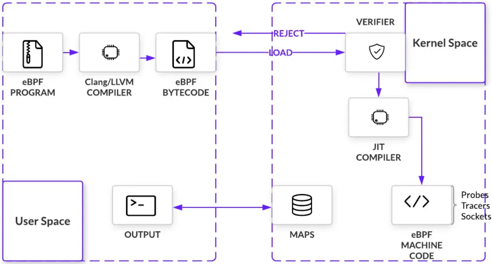

<h1>eBPF</h1>

<h2>目录</h2>

# 介绍

eBPF(extented berkeley packet filter) 是一种内核技术，它允许开发人员在不修改内核代码的情况下，向内核注入自定义代码，从而实现对内核的扩展。

eBPF的概念源自于Berkeley Packet Filter(BPF)，BPF是一种使用内核VM编写打包过滤代码的工作，它可以当作网络过滤器，可以捕获和过滤网络数据包。

充分使用eBPF至少需要Linux4.4以上版本。

# 用途

eBPF是一种非常灵活和强大的内核技术，可以用于多种场景：

- 网络监控：eBPF可以用于捕获网络数据包，并执行特定的逻辑来分析网络流量。例如，可以使用eBPF程序来监控网络流量，并在发现异常流量时进行警报。
- 安全过滤：eBPF可以用于对网络数据包进行安全过滤。例如，可以使用 eBPF程序来阻止恶意流量的传播，或者在发现恶意流量时对其进行拦截。
- 性能分析：eBPF可以用于对内核的性能进行分析。例如，可以使用 eBPF 程序来收集内核的性能指标，并通过特定的接口将其可视化。这样，可以更好地了解内核的性能瓶颈，并进行优化。
- 虚拟化：eBPF可以用于虚拟化技术。例如，可以使用eBPF程序来收集虚拟机的性能指标，并进行负载均衡。这样，可以更好地利用虚拟化环境的资源，提高系统的性能和稳定性。

# 工作原理

eBPF的工作原理主要分为三个步骤：

- 加载
- 编译
- 执行

架构图：

# 代码示例

# 参考资料
