<h1>Istio</h1>
<div align="center">
  <a href="https://istio.io/">
      
  </a>
</div>

<!-- ToC start -->
<h2>Table of Contents</h2>

- [微服务架构的演变](#微服务架构的演变)
  - [Evolution](#evolution)
    - [Monolith架构](#monolith架构)
    - [Microservice架构](#microservice架构)
    - [典型的微服务业务场景](#典型的微服务业务场景)
- [微服务到服务网格还缺什么](#微服务到服务网格还缺什么)
  - [Sidecar的工作原理](#sidecar的工作原理)
    - [系统边界](#系统边界)
    - [Sidecar工作机制](#sidecar工作机制)
  - [Service Mesh](#service-mesh)
  - [微服务的优劣](#微服务的优劣)
    - [优势](#优势)
    - [劣势](#劣势)
  - [服务网格可选方案](#服务网格可选方案)
  - [什么是服务网格](#什么是服务网格)
  - [为什么要使用Istio](#为什么要使用istio)
  - [Istio功能概览](#istio功能概览)
    - [流量管理和控制](#流量管理和控制)
    - [安全](#安全)
    - [可观察性](#可观察性)
  - [架构](#架构)
  - [设计目标](#设计目标)
- [深入理解数据平面Envoy](#深入理解数据平面envoy)
  - [主流七层代理的比较](#主流七层代理的比较)
  - [Enovy的优势](#enovy的优势)
  - [Envoy线程模式](#envoy线程模式)
    - [Envoy架构](#envoy架构)
    - [Envoy API](#envoy-api)
  - [xDS - Envoy的发现机制](#xds---envoy的发现机制)
  - [Envoy的过滤器模式](#envoy的过滤器模式)
- [Istio流量管理](#istio流量管理)
  - [流量管理对象](#流量管理对象)
  - [Istio的流量劫持机制](#istio的流量劫持机制)
    - [为用户应用注入Sidecar](#为用户应用注入sidecar)
    - [注入后的结果](#注入后的结果)
    - [Init Container](#init-container)
    - [Sidecar container](#sidecar-container)
    - [实际例子](#实际例子)
  - [流量管理](#流量管理)
    - [请求路由](#请求路由)
    - [服务之间的通信](#服务之间的通信)
    - [Ingress 和 Egress](#ingress-和-egress)
    - [服务发现和负载均衡](#服务发现和负载均衡)
    - [健康检查和服务熔断](#健康检查和服务熔断)
      - [故障处理](#故障处理)
    - [微调](#微调)
    - [故障注入](#故障注入)
      - [为什么需要错误注入？](#为什么需要错误注入)
      - [Istio的故障注入](#istio的故障注入)
      - [注入的错误可以基于特定的条件，可以设置出现错误的比例：](#注入的错误可以基于特定的条件可以设置出现错误的比例)
    - [配置规则](#配置规则)
      - [在服务之间拆分流量](#在服务之间拆分流量)
      - [超时](#超时)
      - [重试](#重试)
      - [错误注入](#错误注入)
      - [条件规则](#条件规则)
      - [流量镜像](#流量镜像)
      - [规则委托](#规则委托)
      - [优先级](#优先级)
      - [目标规则](#目标规则)
        - [负载均衡](#负载均衡)
        - [连接池](#连接池)
        - [断路器](#断路器)
        - [熔断器](#熔断器)
        - [TLS](#tls)
      - [ServiceEntry](#serviceentry)
      - [WorkloadEntry](#workloadentry)
      - [Gateway](#gateway)
- [Istio多集群](#istio多集群)
  - [网络](#网络)
    - [跨地域流量管理的挑战](#跨地域流量管理的挑战)
    - [规模化带来的挑战(eBay)](#规模化带来的挑战ebay)
    - [多集群部署](#多集群部署)
    - [入站流量架构 L4 + L7](#入站流量架构-l4--l7)
    - [单网关集群多环境支持](#单网关集群多环境支持)
    - [应用高可用接入方案](#应用高可用接入方案)
      - [创建WorkloadEntry](#创建workloadentry)
      - [定义ServiceEntry](#定义serviceentry)
      - [定义基于Locality的流量转发规则](#定义基于locality的流量转发规则)
    - [应对规模化集群的挑战](#应对规模化集群的挑战)
      - [Istiod自身的规模控制](#istiod自身的规模控制)
    - [基于联邦的统一流量模型](#基于联邦的统一流量模型)
    - [统一流量模型 - NameService](#统一流量模型---nameservice)
    - [AccessPoint 控制器](#accesspoint-控制器)
    - [展望](#展望)

<!-- ToC end -->
# 微服务架构的演变

## Evolution

### Monolith架构

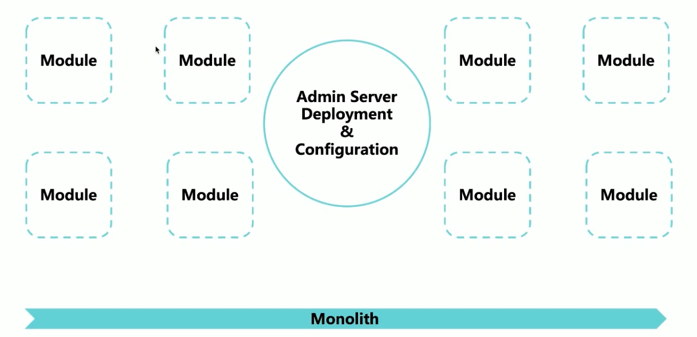

### Microservice架构

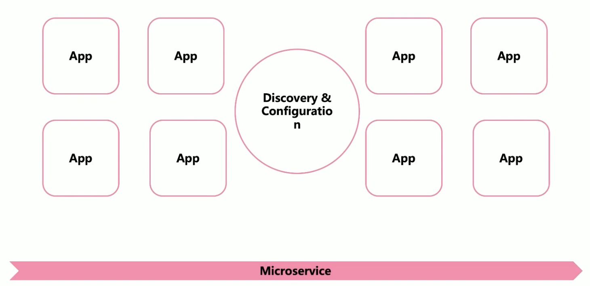

### 典型的微服务业务场景

基于微服务的应用架构：

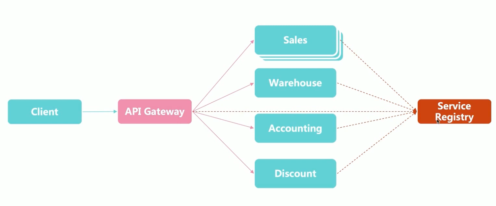

1. 给服务添加熔断机制，来应对服务故障：

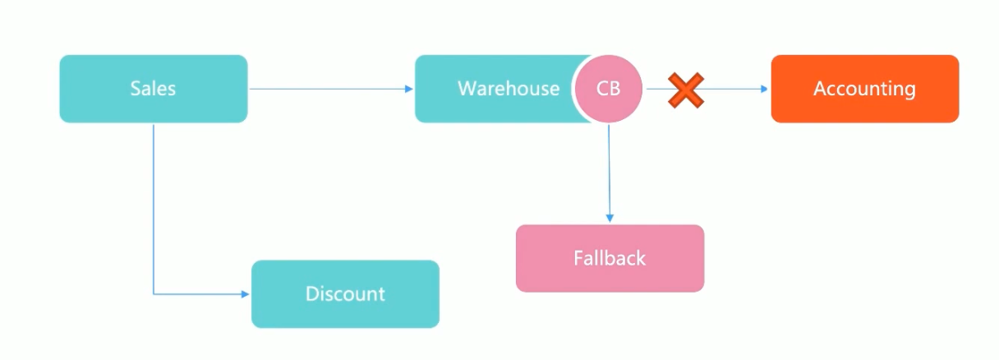


2. 给服务添加负载均衡，服务注册和服务发现：

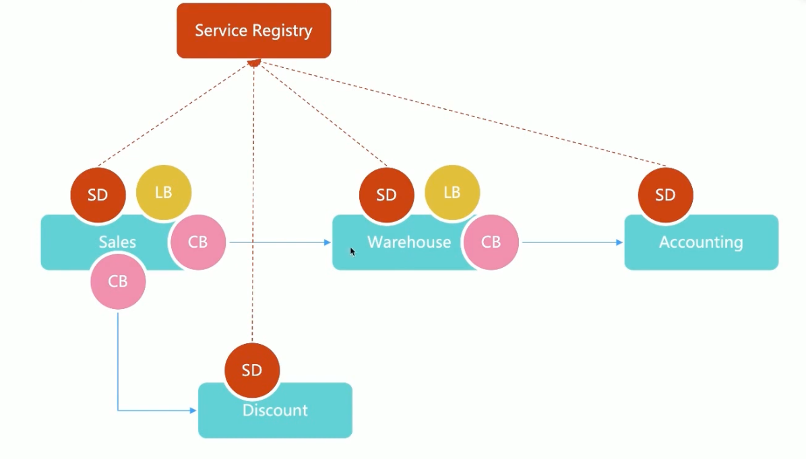

3. 给服务添加认证和授权：

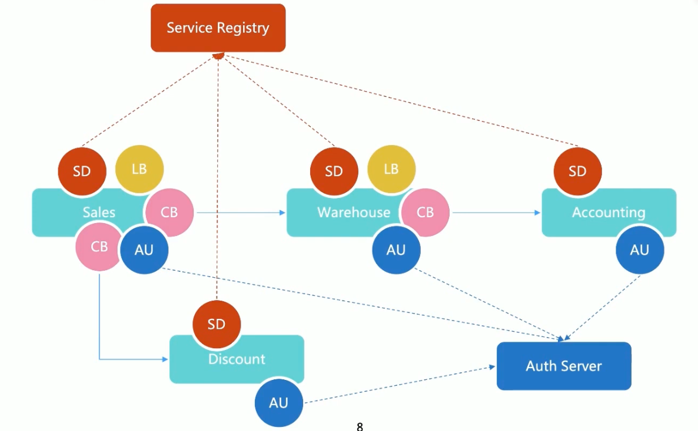

4. 给服务间调用添加TLS

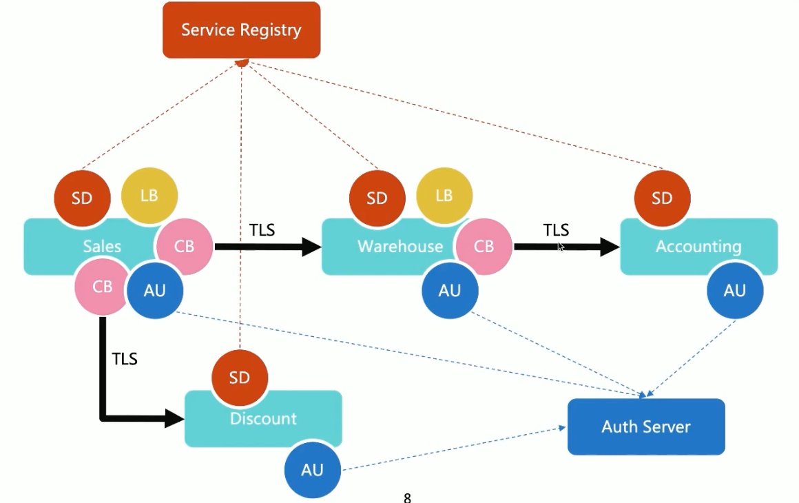

5. 完整的微服务架构：

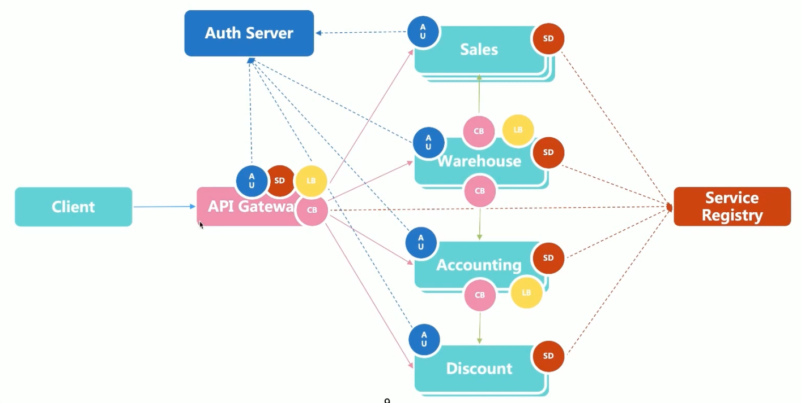

# 微服务到服务网格还缺什么
## Sidecar的工作原理
### 系统边界
服务治理和业务代码结合在一起：

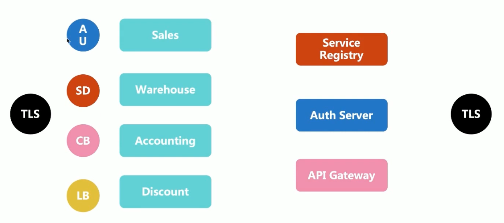

分离服务治理和业务代码后：

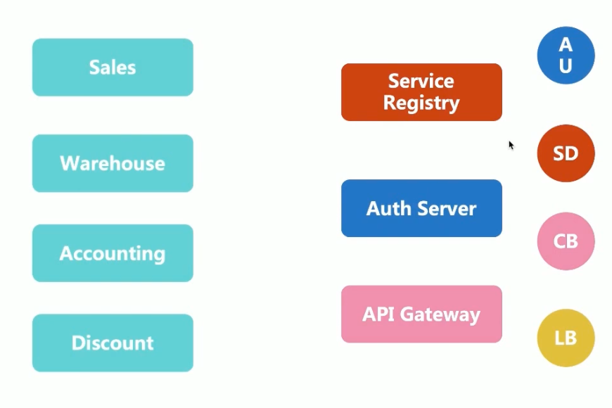
### Sidecar工作机制
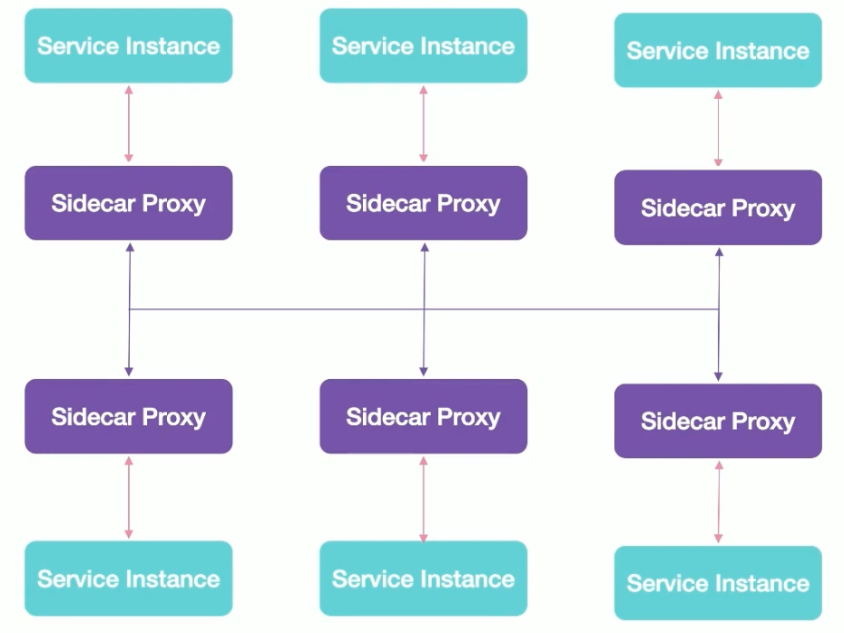
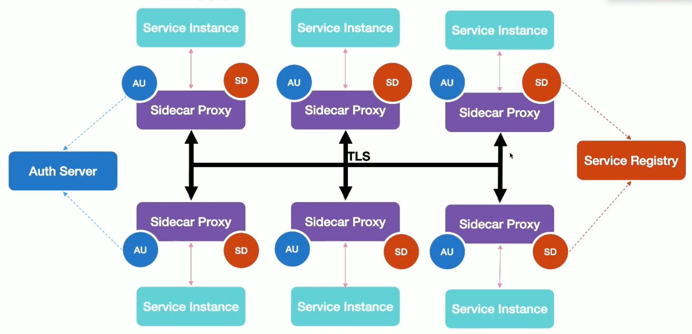
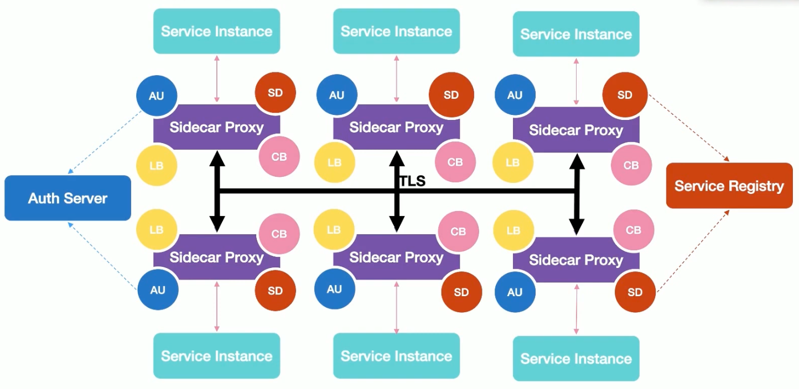

Service Mesh:

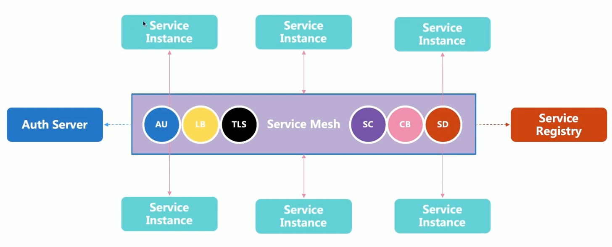

## Service Mesh
- **适应性**
  - 熔断
  - 重试
  - 超时
  - 负载均衡
  - 失败处理
  - Failover
- **服务发现**
  - 服务注册
  - 服务发现
  - 服务路由
- **安全和访问控制**
  - TLS和证书管理
- **可观察性**
  - metrics
  - monitoring
  - distributed tracing
  - distributed logging
- **部署**
  - 容器
- **通信**
  - HTTP
  - WS
  - gRPC
  - TCP
## 微服务的优劣
### 优势
- **将基础结构逻辑从业务代码中剥离出来**
  - 分布式tracing
  - 日志
- **自由选择技术栈**
- **帮助业务开发部门只关注业务逻辑**
### 劣势
- **复杂**
  - 更多的运行实例
- **可能带来额外的网络跳转**
  - 每个服务调用都要经过Sidecar
- **解决了一部分问题，同时要付出代价**
  - 依然要处理复杂路由，类型映射，与外部系统整合等方面的问题
- **不解决业务逻辑或服务整合，服务组合等问题**
## 服务网格可选方案

## 什么是服务网格
服务网格（Service Mesh）这个术语通常用于描述构成这些应用程序的微服务网络及其应用之间的交互。随着规模和复杂性的增长，服务网格越来越难以理解和管理。

它的需求包括：服务发现，负载均衡，故障恢复，指标收集和监控以及通常更加复杂的运维需求，例如A/B测试，金丝雀发布，限流，访问控制和端到端认证等。服务网格提供了一种方法来解决这些问题，而不需要对应用程序进行任何代码更改。

## 为什么要使用Istio

- HTTP，gRPC，WebSockets和TCP流量的自动负载均衡
- 通过丰富的路由规则、重试、故障转移和故障注入、可以对流量行为进行细粒度控制
- 可插入的策略层和配置API，支持访问控制、速率限制和配额
- 对出入集群入口和出口中所有流量的自动度量指标、日志记录和跟踪
- 通过强大的基于身份的验证和授权，在集群中实现安全的服务间通信

## Istio功能概览

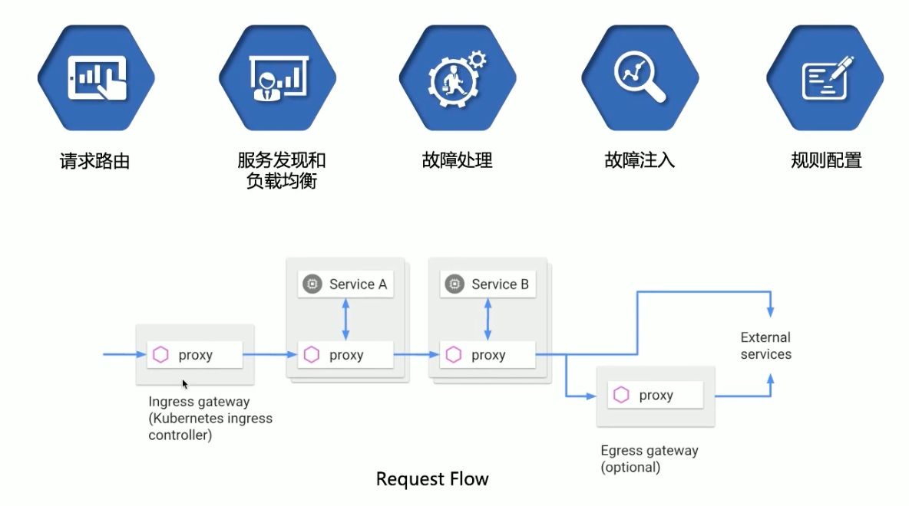

### 流量管理和控制

- **连接**
  - 通过简单的规则配置和流量路由，可以控制服务之间的流量和API调用。Istio简化了断路器、超时和重试等服务级别属性的配置，并且可以轻松设置A/B测试、金丝雀部署和按百分比的流量分割的分阶段部署等重要任务。
- **控制**
  - 通过更好地了解流量和开箱即用的故障恢复功能，可以在问题出现之前先发现问题，使调用更可靠，并且使得网络更加健壮。

### 安全

- **使得开发人员可以专注于应用程序级别的安全性**
  - Istio通过提供一种统一的方法来强制执行策略和配置，从而简化了安全性的复杂性。Istio的安全功能包括服务间的身份验证、授权和加密通信，从而保护服务间的流量，并减轻了应用程序代码中的安全性功能的负担。
- **虽然Istio与平台无关，但将其与Kubernetes（或基础架构）网络策略结合使用，其优势会更大，包括在网络和应用层保护Pod间或服务间通信的能力**

### 可观察性

Istio生成以下类型的遥测数据，以提供对整个服务网络的可观察性：
- **指标**：Istio基于4个监控的黄金指标（延迟、流量、错误和饱和）生成了一系列服务指标。Istio还为网络控制平面提供了更详细的指标。除此以外还提供了一组默认的基于这些指标的网络监控仪表板。
- **分布式追踪**：Istio通过集成Zipkin和Jaeger，提供了对服务间调用的分布式追踪。Istio还提供了一个默认的基于Kiali的服务拓扑图，以帮助您可视化服务网格。
- **访问日志**：当流量流入网格中的服务时，Istio可以生成每个请求的完整记录，包括源和目标的元数据。此信息使得运维人员能够将服务行为的审查控制到单个工作负载实例的级别。

<p><span style="color:yellow;font-weight: bold">所有这些功能可以更有效地设置、监控和实施服务上的SLO，快速有效地检测和修复问题。</span></p>

## 架构

- **架构演进**
  - 从微服务回归单体架构

  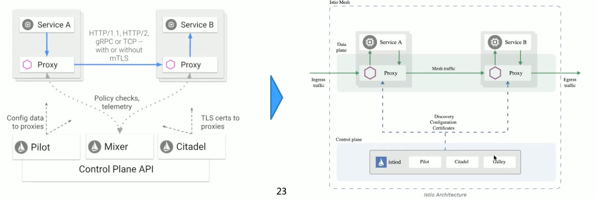
- **数据平面**
  - 由一组以Sidecar方式部署智能代理（Envoy）组成。
- **控制平面**
  - 负责管理和配置代理来路由流量。

## 设计目标

- **最大透明度**
  - Istio将自身自动注入到服务间所有的网络路径中，运维和开发人员只需要付出很少的代价就可以从中受益。
  - Istio使用Sidecar代理捕获流量，并且在尽可能的地方自动编程网络层，以路由流量通过这些代理，而无需对已部署的应用程序代码进行改动。
  - 在Kubernetes中，代理被注入到Pod中，通过编写iptables规则来捕获流量。注入Sidecar代理到Pod中并且修改路由规则后，Istio就能够调解所有流量。
  - 所有组件和API在设计时都必须考虑性能和规模。
- **增量**
  - 预计最大的需求时扩展策略系统，集成其他策略和控制来源，并将网格行为信号传播到其他系统进行分析。策略运行时支持标准扩展机制以便插入到其他服务中。
- **可移植性**
  - 将基于Istio的服务移植到新环境应该是轻而易举，而使用Istio将一个服务同时部署到多个环境中也是可行的。
- **策略一致性**
  - 在服务间的API调用中，策略的应用使得可以对网格间行为进行全面的控制，但对于无需在API级别表达的资源来说，对资源应用策略也同样重要。
  - 因此，策略系统作为独特的服务来维护，具有自己的API，而不是将其放到代理/Sidecar中，这容许服务根据需要直接与其集成。

# 深入理解数据平面Envoy

## 主流七层代理的比较

|   |  Envoy | Nginx  | HA Proxy  |
|---|---|---|---|
| HTTP/2  | 对HTTP/2有完整支持，同时支持upstream和downstream HTTP/2.  | 从1.9.5开始支持HTTP/2  | HAProxy Enterprise才支持HTTP/2  |
| Rate Limit  | 通过插件支持限流  | 支持基于配置的限流，只支持基于源IP的限流  |   |
| ACL  | 基于插件实现四层ACL  | 基于源/目标地址实现ACL  |   |
| Connection draining  | 支持hot reload, 并且通过share memory实现connection draning的功能 | Nginx Plus收费版支持connection draining  | 支持热启动，但不保证丢弃连接 |

## Enovy的优势

- **性能**
  - 在具备大量特征的同时，Envoy提供极高的吞吐量和低尾部延迟差异，而CPU和RAM消耗却相对较少。
- **可扩展性**
  - Envoy在L4和L7都提供了丰富的可插拔过滤器能力，使得用户可以轻松添加开源版本中没有的功能。
- **API可配置性**
  - Envoy提供了一组可以通过控制平面服务实现的管理API。如果控制平面实现所有的API，则可以使用通过引导配置在整个基础架构上运行Enovy。所有进一步的配置更改通过管理服务器以无缝方式发送传送，因此Enovy从不需要重新启动。这使得Envoy成为通用数据平台，当它与一个足够复杂的控制平面相结合时，会极大地降低整体运维的复杂性。

## Envoy线程模式
- **Envoy采用单进程多线程模式**
  - 主线程负责协调
  - 子线程负责监听过滤和转发
- 当某连接被监听器接收，那么该连接的全部生命周期会与某线程绑定
- Envoy基于非阻塞模式（Epoll）
- **建议Envoy配置的worker数量与Envoy所在的硬件线程数一致**

### Envoy架构
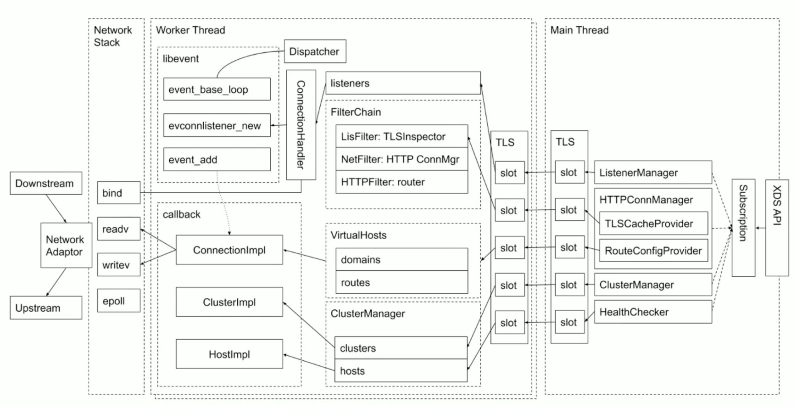

### Envoy API
- **v1 API仅使用JSON/REST，本质上是轮询**，缺点有：
  - 尽管Envoy在内部使用的是JSON模式，但API本身并不是强一致性，而且安全地实现他们的通用服务器也很难。
  - 虽然轮询工作在实践中是很正常的用法，但更强大的控制平面更喜欢streaming API, 当其就绪后，可以将更新推送给每个Envoy。这可以将更新传播时间从30-60s降低到250-500ms，即使在极其庞大的部署中也是如此。
- **v2 API具有以下属性**
  - 新API模式使用protobuf 3指定，并同时以gRPC和REST + JSON/YAML端点实现。
  - 它们被定义在一个名为envoy-api的新的专用源码仓库中。protobuf3的使用意味着这些API是强一致性的，同时仍然通过protobuf3的JSON/YAML表示支持JSON/YAML的变体。
  - 专用仓库的使用意味着项目可以更容易的使用API并用gRPC支持的语言生成存根（实际上，对于希望使用它的用户，我们将继续支持基于REST的JSON/YAML变体）
  - 它们是streaming API，这意味着控制平面可以将更新推送到Envoy，而不是Envoy轮询控制平面。
## xDS - Envoy的发现机制
- 配置
  - **Listener Discovery Service (LDS)**: 用于配置Envoy的监听器
    - **Route Discovery Service (RDS)**: 用于配置Envoy的路由
- 状态
  - **Cluster Discovery Service (CDS)**: 用于配置Envoy的集群
    - **Endpoint Discovery Service (EDS)**: 用于配置Envoy的终端
- 安全
  - **Secret Discovery Service (SDS)**: 用于配置Envoy的TLS证书
- 健康检查
  - **Health Discovery Service (HDS)**: 用于配置Envoy的健康检查
- 协调
  - **Aggregated Discovery Service (ADS)**: 用于配置Envoy的聚合服务

## Envoy的过滤器模式

 

# Istio流量管理

## 流量管理对象

- Gateway
- VirtualService
- DestinationRule
- ServiceEntry
- WorkloadEntry
- Sidecar

## Istio的流量劫持机制

### 为用户应用注入Sidecar

- 自动注入
- 手动注入
  - `istioctl kube-inject -f <your-app-spec>.yaml | kubectl apply -f -`
  - `kubectl apply -f <(istioctl kube-inject -f <your-app-spec>.yaml)`

### 注入后的结果

- 注入了 init-container, istio-init
  - istio-init 会修改应用的iptables规则，将所有的流量都重定向到sidecar
    - `istio-iptables -p 15001 -z 15006 -u 1337 -m REDIRECT -i * -x -b 9080 -d 15090,15021,15020`
- 注入了 sidecar-container, istio-proxy
  - istio-proxy 会拦截所有的流量，根据配置的规则进行处理
    - `istioctl proxy-config routes <pod-name>.<namespace>`

### Init Container

**将应用容器的所有流量都转发到Envoy的15001端口。**

使用istio-proxy用户身份运行，UID为1337， 即Envoy所处的用户空间，这也是istio-proxy的默认使用的用户（YAML配置中的runAsUser字段）。

使用默认的REDIRECT模式，将所有流量重定向到Envoy的15006端口。

将所有的出站流量重定向到15001端口，以便Envoy可以拦截它们。

查看injected pod里的iptables规则：
- 进入所在的host, 找到对应的pod的network namespace
  - `docker ps | grep <pod-name>`
  - `docker inspect <container-id> | grep -i pid`
- 进入network namespace
  - `nsenter -t <pid> -n`
- 查看iptables规则
  - `iptables -t nat -L -n -v` or `iptables-save -t nat`

```zsh
// 所有入站流量走ISTIO_INBOUND链
-A PREROUTING -p tcp -j ISTIO_INBOUND

// 所有出站流量走ISTIO_OUTPUT链
-A OUTPUT -p tcp -j ISTIO_OUTPUT

// ISTIO_INBOUND链, 忽略ssh,health_check等端口
-A ISTIO_INBOUND -p tcp -m tcp --dport 22 -j RETURN
-A ISTIO_INBOUND -p tcp -m tcp --dport 15090 -j RETURN
-A ISTIO_INBOUND -p tcp -m tcp --dport 15021 -j RETURN
-A ISTIO_INBOUND -p tcp -m tcp --dport 15020 -j RETURN

// 所有入站TCP流量走ISTIO_REDIRECT链
-A ISTIO_INBOUND -p tcp -j ISTIO_REDIRECT

// TCP流量转发到15006端口
-A ISTIO_REDIRECT -p tcp -j REDIRECT --to-ports 15006

// loopback passthrough
-A ISTIO_OUTPUT -s 127.0.0.1/32 -o lo -j RETURN

// 从loopback口出来，目标非本地地址，owner是envoy，交由ISTIO_IN_REDIRECT链处理
-A ISTIO_OUTPUT ! -d 127.0.0.1/32 -o lo -m owner --uid-owner 1337 -j ISTIO_IN_REDIRECT

// 从loopback口出来，owner不是envoy，return
-A ISTIO_OUTPUT -o lo -m owner ! --uid-owner 1337 -j RETURN

// owner是envoy, return
-A ISTIO_IN_REDIRECT -m owner --uid-owner 1337 -j RETURN

// 从loopback口出来，目标非本地地址，group owner是envoy，交由ISTIO_IN_REDIRECT链处理
-A ISTIO_OUTPUT ! -d 127.0.0.1/32 -o lo -m owner --gid-owner 1337 -j ISTIO_IN_REDIRECT

// 从loopback口出来，group owner不是envoy，return
-A ISTIO_OUTPUT -o lo -m owner ! --gid-owner 1337 -j RETURN

// group owner是envoy, return
-A ISTIO_IN_REDIRECT -m owner --gid-owner 1337 -j RETURN

// 目标是本地地址，return
-A ISTIO_OUTPUT -d 127.0.0.1/32 -j RETURN

// 如果以上规则都不匹配，则交由ISTIO_REDIRECT链处理
-A ISTIO_OUTPUT -j ISTIO_REDIRECT

// ISTIO_REDIRECT链, TCP流量转发到15001端口
-A ISTIO_REDIRECT -p tcp -j REDIRECT --to-ports 15001
```

### Sidecar container
Istio-proxy的主要功能是拦截所有的流量，根据配置的规则进行处理。

Istio-proxy的配置信息存储在Pilot中，Istio-proxy会定期从Pilot中拉取最新的配置信息。

Istio-proxy会将所有的流量转发到15001端口，以便Envoy可以拦截它们。

Istio会生成以下监听器：
- **0.0.0.0:15001** 上的监听器接收进出Pod的所有流量，然后将请求移交给虚拟监听器。
- 每个service IP一个虚拟监听器，每个出站TCP/HTTPS流量一个非HTTP监听器。
- 每个Pod入站流量暴露的端口一个虚拟监听器。
- 每个出站HTTP流量的HTTP 0.0.0.0 端口一个虚拟监听器。

查看listener配置：
- `istioctl proxy-config listener <pod-name>.<namespace> --port 15001 -o json`

```json
    {
        "name": "virtualOutbound",
        "address": {
            "socketAddress": {
                "address": "0.0.0.0",
                "portValue": 15001
            }
        },
        "filterChains": [
            {
                "filterChainMatch": {
                    "destinationPort": 15001
                },
                "filters": [
                    {
                        "name": "istio.stats",
                        "typedConfig": {
                            "@type": "type.googleapis.com/udpa.type.v1.TypedStruct",
                            "typeUrl": "type.googleapis.com/stats.PluginConfig",
                            "value": {}
                        }
                    },
                    {
                        "name": "envoy.filters.network.tcp_proxy",
                        "typedConfig": {
                            "@type": "type.googleapis.com/envoy.extensions.filters.network.tcp_proxy.v3.TcpProxy",
                            "statPrefix": "BlackHoleCluster",
                            "cluster": "BlackHoleCluster"
                        }
                    }
                ],
                "name": "virtualOutbound-blackhole"
            },
            {
                "filters": [
                    {
                        "name": "istio.stats",
                        "typedConfig": {
                            "@type": "type.googleapis.com/udpa.type.v1.TypedStruct",
                            "typeUrl": "type.googleapis.com/stats.PluginConfig",
                            "value": {}
                        }
                    },
                    {
                        "name": "envoy.filters.network.tcp_proxy",
                        "typedConfig": {
                            "@type": "type.googleapis.com/envoy.extensions.filters.network.tcp_proxy.v3.TcpProxy",
                            "statPrefix": "PassthroughCluster",
                            "cluster": "PassthroughCluster",
                            "accessLog": [
                                {
                                    "name": "envoy.access_loggers.file",
                                    "typedConfig": {
                                        "@type": "type.googleapis.com/envoy.extensions.access_loggers.file.v3.FileAccessLog",
                                        "path": "/dev/stdout",
                                        "logFormat": {
                                            "textFormatSource": {
                                                "inlineSting": ""
                                            }
                                        }
                                    }
                                }
                            ]
                        }
                    }
                ],
                "name": "virtualOutbound-catchall-tcp"
            }
        ],
        "useOriginalDst": true,
        "trafficDirection": "OUTBOUND",
        "accessLog": [
            {
                "name": "envoy.access_loggers.file",
                "filter": {
                    "responseFlagFilter": {
                        "flags": [
                            "NR"
                        ]
                    }
                },
                "typedConfig": {
                    "@type": "type.googleapis.com/envoy.extensions.access_loggers.file.v3.FileAccessLog",
                    "path": "/dev/stdout",
                    "logFormat": {
                        "textFormatSource": {
                            "inlineSting": ""
                        }
                    }
                }
            }
        ]
    }

```

check config dump:
- `istioctl proxy-config dump <pod-name>.<namespace> -o json`
- 进入Pod中，执行`curl http://localhost:15000/config_dump`，查看Envoy的配置信息

我们的请求是到“80”端口的HTTP出站请求，这意味着它被切换到“0.0.0.0:80”虚拟监听器。然后，此监听器在其配置的RDS中查找路由配置。在这种情况下，它将查找有Pilot配置的RDS中的路由“80”（通过ADS）

`istioctl proxy-config listener nginx-deployment-77b4fdf86c-rf697 --port 80 --address 0.0.0.0 -o json`

```json
[
    {
        "name": "0.0.0.0_80",
        "address": {
            "socketAddress": {
                "address": "0.0.0.0",
                "portValue": 80
            }
        },
        "filterChains": [
            {
                "filterChainMatch": {
                    "transportProtocol": "raw_buffer",
                    "applicationProtocols": [
                        "http/1.1",
                        "h2c"
                    ]
                },
                "filters": [
                    {
                        "name": "envoy.filters.network.http_connection_manager",
                        "typedConfig": {
                            "@type": "type.googleapis.com/envoy.extensions.filters.network.http_connection_manager.v3.HttpConnectionManager",
                            "statPrefix": "outbound_0.0.0.0_80",
                            "rds": {
                                "configSource": {
                                    "ads": {},
                                    "initialFetchTimeout": "0s",
                                    "resourceApiVersion": "V3"
                                },
                                "routeConfigName": "80"
                            },
                            "httpFilters": [
                            ],
                            "tracing": {
                            },
                            "streamIdleTimeout": "0s",
                            "accessLog": [
                            ],
                            "useRemoteAddress": false,
                            "upgradeConfigs": [
                                {
                                    "upgradeType": "websocket"
                                }
                            ],
                            "normalizePath": true,
                            "pathWithEscapedSlashesAction": "KEEP_UNCHANGED",
                            "requestIdExtension": {
                                "typedConfig": {
                                }
                            }
                        }
                    }
                ]
            }
        ],
        "defaultFilterChain": {
            "filterChainMatch": {},
            "filters": [
                {
                    "name": "istio.stats",
                    "typedConfig": {
                        "@type": "type.googleapis.com/udpa.type.v1.TypedStruct",
                        "typeUrl": "type.googleapis.com/stats.PluginConfig",
                        "value": {}
                    }
                },
                {
                    "name": "envoy.filters.network.tcp_proxy"
                }
            ],
            "name": "PassthroughFilterChain"
        },
        "listenerFilters": [
            {
                "name": "envoy.filters.listener.tls_inspector",
                "typedConfig": {
                    "@type": "type.googleapis.com/envoy.extensions.filters.listener.tls_inspector.v3.TlsInspector"
                }
            },
            {
                "name": "envoy.filters.listener.http_inspector",
                "typedConfig": {
                    "@type": "type.googleapis.com/envoy.extensions.filters.listener.http_inspector.v3.HttpInspector"
                }
            }
        ],
        "listenerFiltersTimeout": "0s",
        "continueOnListenerFiltersTimeout": true,
        "trafficDirection": "OUTBOUND",
        "accessLog": [
        ],
        "bindToPort": false
    }
]

```

此集群配置为从Pilot(通过ADS)检索关联的端点。因此，Envoy将ServiceName字段作为密钥，以检索与该服务关联的所有端点，并将请求代理到其中一个端点。

`istioctl pc clusters nginx-deployment-77b4fdf86c-rf697 --fqdn nginx.sidecar.svc.cluster.local -o json`

```json
[
  {
    "transportSocketMatches": [
      {
        "name": "tlsMode-istio",
        "match": {
          "tlsMode": "istio"
        },
        "transportSocket": {
          "name": "envoy.transport_sockets.tls",
          "typedConfig": {
            "sni": "outbound_.80_._.nginx.sidecar.svc.cluster.local"
          }
        }
      },
      {
        "name": "tlsMode-disabled",
        "match": {},
        "transportSocket": {
          "name": "envoy.transport_sockets.raw_buffer",
          "typedConfig": {
            "@type": "type.googleapis.com/envoy.extensions.transport_sockets.raw_buffer.v3.RawBuffer"
          }
        }
      }
    ],
    "name": "outbound|80||nginx.sidecar.svc.cluster.local",
    "type": "EDS",
    "edsClusterConfig": {
      "edsConfig": {
        "ads": {},
        "initialFetchTimeout": "0s",
        "resourceApiVersion": "V3"
      },
      "serviceName": "outbound|80||nginx.sidecar.svc.cluster.local"
    },
    "connectTimeout": "10s",
    "lbPolicy": "LEAST_REQUEST",
    "circuitBreakers": {
      "thresholds": [
        {
          "maxConnections": 4294967295,
          "maxPendingRequests": 4294967295,
          "maxRequests": 4294967295,
          "maxRetries": 4294967295,
          "trackRemaining": true
        }
      ]
    },
    "commonLbConfig": {
      "localityWeightedLbConfig": {}
    },
    "metadata": {
      "filterMetadata": {
        "istio": {
          "default_original_port": 80,
          "services": [
            {
              "host": "nginx.sidecar.svc.cluster.local",
              "name": "nginx",
              "namespace": "sidecar"
            }
          ]
        }
      }
    },
    "filters": [
      {
        "name": "istio.metadata_exchange",
        "typedConfig": {
          "@type": "type.googleapis.com/envoy.tcp.metadataexchange.config.MetadataExchange",
          "protocol": "istio-peer-exchange"
        }
      }
    ]
  }
]
```

### 实际例子

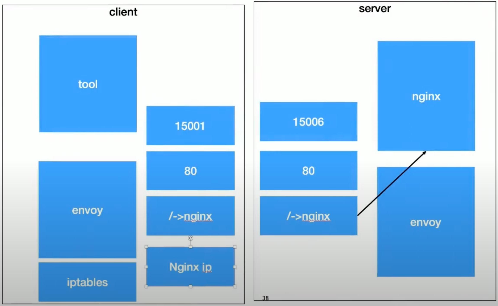

## 流量管理

- **Traffic splitting from infrastructure scaling**: proportion of traffic routed to a version is dependent of number of instances of that version.
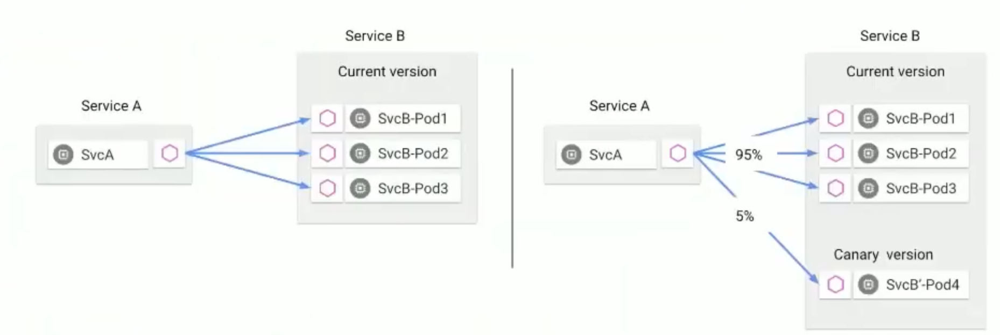
- **Content-based steering**: traffic is routed to a version based on HTTP headers, cookies, or other information in the request. The content of a request can be used to determinie the destination of a request.
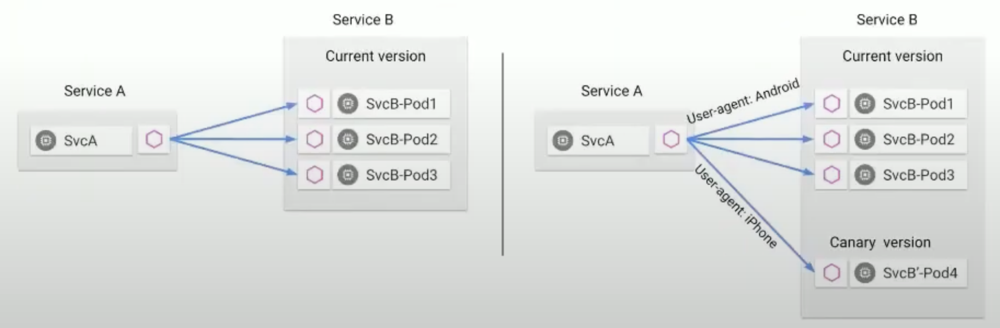

### 请求路由
**特定网格中服务的规范表示由Pilot提供**。服务中的Istio模型和底层平台（Kubernetes、Mesos以及Cloud Foundry）中的表达无关。特定平台的适配器负责从各自平台中获取元数据的各种字段，然后对服务模型进行填充。

**Istio引入了服务版本的概念，可以通过版本（v1、v2）或环境（staging, production）对服务进行进一步细分**。这些版本不一定是不同的API版本：它们可能是部署在不同环境中的同一服务的不同迭代。使用这种方式的常见场景包括A/B测试或金丝雀部署。

**Istio的流量路由规则可以根据服务版本来对服务之间的流量进行附加控制**

### 服务之间的通信
**服务的客户端不知道服务不同版本间的差异**。它们可以使用服务的主机名或者IP地址继续访问服务。Envoy sidecar/代理拦截并转发客户端与服务器端之间的所有请求和响应。

**Istio支持HTTP、gRPC、TCP和TLS协议**。Istio的流量管理功能可以应用于所有这些协议。

Istio还为同一服务的多个实例提供流量负载均衡。可以在服务发现和负载均衡中找到更多信息。

Istio不提供DNS。**应用程序可以使用底层平台中存在的DNS服务（kube-dns）来解析FQDN**。

### Ingress 和 Egress
**Istio假定进入和离开网络的所有流量都会通过Envoy代理进行传输**。

通过将Envoy代理部署在服务之前，运维人员可以针对面向用户的服务进行A/B测试、金丝雀部署、流量控制和故障注入。**Istio支持多种入口网关，包括HTTP、gRPC和TCP流量**。

类似地，通过使用Envoy将流量路由到外部Web服务(比如，访问Maps API或视频服务API)的方式，运维人员可以对流量进行控制，比如添加超时控制，重试，熔断等功能，同时还能从服务连接中获取各种细节指标。**Istio支持HTTP、gRPC和TCP流量的出口网关**。

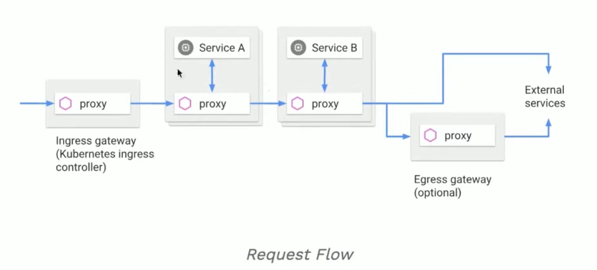

### 服务发现和负载均衡
**Istio负载均衡网络中实例之间的通信**。

Istio假定存在服务注册表，以跟踪应用程序中服务的实例。它还假定服务的新实例自动注册到服务注册表，并且不健康的实例将被自动删除。

Pilot使用来自服务注册的信息，并提供与平台无关的服务发现接口。网格中的Envoy实例执行服务发现，并相应地动态更新其负载均衡池。

网格中的服务使用其DNS名称访问彼此。服务的所有HTTP流量都会通过Envoy自动重新路由。Envoy在负载均衡池中的实例之间分发流量。

- **支持的负载均衡算法**
  - 轮询（Round Robin）：将请求依次分配给后端服务实例，每个实例接收到的请求数相等。
  - 最少连接（Least Connections）：将请求分配给当前连接数最少的后端服务实例。
  - 随机（Random）：随机选择一个后端服务实例来处理请求。
  - 加权轮询（Weighted Round Robin）：将请求分配给后端服务实例，但是可以为每个实例分配不同的权重，以便更多的请求被分配给更强大的实例。
  - 加权最连接（Weighted Least Connections）：将请求分配给当前连接数最少的后端服务实例，但是可以为每个实例分配不同权重，以便更多的请求被分配给更强大的实例。
- **支持的负载均衡模式**
  - Simple：简单的负载均衡模式，将请求均匀地分配给后端服务例。
  - Consistent Hash：使用哈希函数将请求路由到特定的后端服务实例，以便在缓存和会话管理等方实现更好的性能。
  - Least Request：将请求分配给当前处理请求最少的后端服务实例。
  - Random：随机选择一个后端服务实例来处理请求。

### 健康检查和服务熔断
**Envoy会定期检查池中每个实例的运行状况**。Envoy遵循熔断器风格模式，根据健康检查API调用的失败率将实例分类为不健康和健康两种。当给定实例的健康检查失败次数超过预定阀值时，将会从负载均衡池中弹出。类似地，当通过的健康检查成功数超过预定阀值时，该实例将会被添加会负载均衡池。

**服务可以通过使用HTTP 503响应健康检查来主动减轻负担。在这种情况下，服务实例将立即从调用者的负载均衡池中删除。**

#### 故障处理
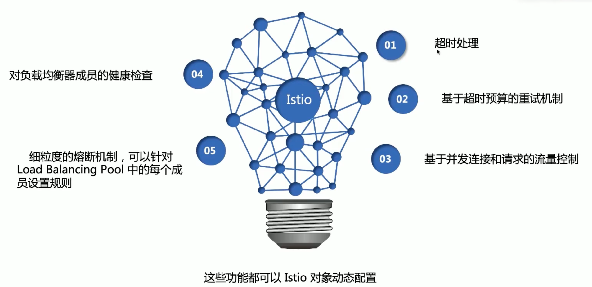

### 微调
**Istio的流量管理规则允许运维人员为每个服务/版本设置故障恢复的全局默认值**。然而，服务的消费者也可以通过特殊的HTTP头提供请求级别值覆盖超时和重试默认值。在Envoy代理的实现中，对应的Header分别是x-envoy-upstream-rq-timeout-ms和x-envoy-max-retries。

### 故障注入
#### 为什么需要错误注入？
微服务架构下，需要测试端到端的故障恢复能力。

#### Istio的故障注入
Istio允许在网络层面按协议注入错误来模拟错误，无需通过应用层面删除Pod，或人为在TCP层造成网络故障来模拟。

#### 注入的错误可以基于特定的条件，可以设置出现错误的比例：
- **延迟注入**：提高网络延时。
- **中断注入**：直接返回特定的错误码。
### 配置规则
- **VirtualService**：定义了路由规则，用于将流量路由到特定的服务版本。
- **DestinationRule**：定义了服务版本的负载均衡策略和连接池的配置,是VirtualService路由生效后，配置应用与请求的策略集。
- **ServiceEntry**：定义了服务的入口，用于将流量路由到网格外的服务。通常用于在Istio服务网格之外启用对服务的请求。
- **Gateway**：为HTTP/TCP流量配置负载均衡器，最常见的是在网络的边缘的操作，以启用应用程序的入口流量。

#### 在服务之间拆分流量
**例如下面的规则会把25%的流量路由到v1版本，75%的流量路由到v2版本**

```yaml
apiVersion: networking.istio.io/v1alpha3
kind: VirtualService
metadata:
  name: reviews
spec:
  hosts:
  - reviews
  http:
  - route:
    - destination:
        host: reviews
        subset: v1
      weight: 25
    - destination:
        host: reviews
        subset: v2
      weight: 75
```

#### 超时
**例如下面的规则会把reviews服务的超时时间设置为10秒**

```yaml
apiVersion: networking.istio.io/v1alpha3
kind: VirtualService
metadata:
  name: reviews
spec:
  hosts:
  - reviews
  http:
  - timeout: 10s
    route:
    - destination:
        host: reviews
        subset: v1
```
#### 重试
**例如下面的规则会把reviews服务的重试次数设置为3次**

```yaml
apiVersion: networking.istio.io/v1alpha3
kind: VirtualService
metadata:
  name: reviews
spec:
  hosts:
  - reviews
  http:
  - retries:
      attempts: 3
      perTryTimeout: 2s
    route:
    - destination:
        host: reviews
        subset: v1
```

#### 错误注入
**例如下面的规则会把reviews服务的错误注入设置为50%**

```yaml
apiVersion: networking.istio.io/v1alpha3
kind: VirtualService
metadata:
  name: reviews
spec:
  hosts:
  - reviews
  http:
  - fault:
      delay:
        percent: 50
        fixedDelay: 7s
    route:
    - destination:
        host: reviews
        subset: v1
```

```yaml
apiVersion: networking.istio.io/v1alpha3
kind: VirtualService
metadata:
  name: reviews
spec:
  hosts:
  - reviews
  http:
  - fault:
      abort:
        percent: 50
        httpStatus: 500
    route:
    - destination:
        host: reviews
        subset: v1
```

#### 条件规则
```yaml
apiVersion: networking.istio.io/v1alpha3
kind: VirtualService
metadata:
  name: reviews
spec:
  hosts:
  - reviews
  http:
  - match:
    - headers:
        end-user:
          exact: jason
    route:
    - destination:
        host: reviews
        subset: v3
```

```yaml
apiVersion: networking.istio.io/v1alpha3
kind: VirtualService
metadata:
  name: reviews
spec:
  hosts:
  - reviews
  http:
  - match:
    - uri:
        prefix: /api/v1
    route:
    - destination:
        host: reviews
        subset: v3
```

```yaml
apiVersion: networking.istio.io/v1alpha3
kind: VirtualService
metadata:
  name: reviews
spec:
  hosts:
  - reviews
  http:
  - match:
    - sourceLabels:
        version: v3
    route:
    - destination:
        host: reviews
        subset: v3
```

#### 流量镜像
mirror规则可以使Envoy截取所有request, 并转发请求的同时，将request转发至mirror版本，同时在Header的Host/Authority中加上-shadow后缀，以便区分。

**这些mirror请求会工作在fire and forget模式，所有的response都会被废弃。**

```yaml
apiVersion: networking.istio.io/v1alpha3
kind: VirtualService
metadata:
  name: reviews
spec:
  hosts:
  - reviews.prod.svc.cluster.local
  http:
  - mirror:
      host: reviews.test.svc.cluster.local
    route:
    - destination:
        host: reviews.prod.svc.cluster.local
        subset: v1
```

#### 规则委托
```yaml
apiVersion: networking.istio.io/v1alpha3
kind: VirtualService
metadata:
  name: bookinfo
spec:
  hosts:
  - "bookinfo.com"
  gateways:
  - bookinfo-gateway
  http:
  - match:
    - uri:
        prefix: /productpage
    delegate:
      name: productpage
      namespace: nsA
  - match:
    - uri:
        prefix: /reviews
    delegate:
      name: reviews
      namespace: nsB
```

```yaml
apiVersion: networking.istio.io/v1alpha3
kind: VirtualService
metadata:
  name: productpage
  namespace: nsA
spec:
  hosts:
  - "bookinfo.com"
  http:
  - route:
    - destination:
        host: productpage
        subset: v1
```

```yaml
apiVersion: networking.istio.io/v1alpha3
kind: VirtualService
metadata:
  name: reviews
  namespace: nsB
spec:
  hosts:
  - "bookinfo.com"
  http:
  - route:
    - destination:
        host: reviews
        subset: v1
```

#### 优先级
**当对同一目标有多个规则时，会按照VirtualService的顺序进行应用。换句话说，列表中的第一条规则具有最高优先级，**

#### 目标规则
**在请求被VirtualService路由之后，DestinationRule配置的一系列策略就生效了**。这些厕率也偶服务者编写，包含断路器，负载均衡，连接池，TLS等。

##### 负载均衡
```yaml
apiVersion: networking.istio.io/v1alpha3
kind: DestinationRule
metadata:
  name: reviews
spec:
  host: reviews
  trafficPolicy:
    loadBalancer:
      simple: RANDOM
    subsets:
    - name: v1
      labels:
        version: v1
    - name: v2
      labels:
        version: v2
      trafficPolicy:
        loadBalancer:
          simple: ROUND_ROBIN
    - name: v3
      labels:
        version: v3
      trafficPolicy:
        loadBalancer:
          simple: LEAST_CONN
```
##### 连接池
```yaml
apiVersion: networking.istio.io/v1alpha3
kind: DestinationRule
metadata:
  name: reviews
spec:
  host: reviews
  trafficPolicy:
    connectionPool:
      tcp:
        maxConnections: 100
      http:
        http1MaxPendingRequests: 100
        maxRequestsPerConnection: 1
```
##### 断路器
```yaml
apiVersion: networking.istio.io/v1alpha3
kind: DestinationRule
metadata:
  name: reviews
spec:
  host: reviews
  trafficPolicy:
    outlierDetection:
      consecutiveErrors: 5
      interval: 5s
      baseEjectionTime: 30s
      maxEjectionPercent: 10
```

##### 熔断器
```yaml
apiVersion: networking.istio.io/v1alpha3
kind: DestinationRule
metadata:
  name: reviews
spec:
  host: reviews
  trafficPolicy:
    circuitBreaker:
      simpleCb:
        maxConnections: 100
        httpMaxRequests: 100
        sleepWindow: 10s
        httpDetectionInterval: 10s
        httpMaxEjectionPercent: 10
```

##### TLS
```yaml
apiVersion: networking.istio.io/v1alpha3
kind: DestinationRule
metadata:
  name: reviews
spec:
  host: reviews
  trafficPolicy:
    tls:
      mode: ISTIO_MUTUAL
      clientCertificate: /etc/certs/myclientcert.pem
      privateKey: /etc/certs/client_private_key.pem
      caCertificates: /etc/certs/rootcacerts.pem
```

#### ServiceEntry
**ServiceEntry用于将外部服务注册到Istio的服务注册表中，以便于在Istio内部使用。**

只要ServiceEntry涉及了匹配的host的服务，就可以和VirtualService和DestinationRule配合工作。

```yaml
apiVersion: networking.istio.io/v1alpha3
kind: ServiceEntry
metadata:
  name: external-svc-httpbin
spec:
  hosts:
  - *.httpbin.com
  ports:
  - number: 80
    name: http
    protocol: HTTP
  - number: 443
    name: https
    protocol: HTTPS
  resolution: DNS
```
#### WorkloadEntry
```yaml
apiVersion: networking.istio.io/v1alpha3
kind: WorkloadEntry
metadata:
  name: external-svc-httpbin
spec:
  serviceAccount: httpbin
  address:
    - 192.168.31.79
  labels:
    app: httpbin
    instance-id: httpbin-1
```

```yaml
apiVersion: networking.istio.io/v1alpha3
kind: ServiceEntry
metadata:
  name: external-svc-httpbin
spec:
  hosts:
  - httpbin.com
  ports:
  - number: 80
    name: http
    protocol: HTTP
  resolution: STATIC
  workloadSelector:
    labels:
      app: httpbin
```

#### Gateway
**Gateway为HTTP/TCP流量配置了一个负载均衡，多数情况下在网络边缘进行操作，用于启用一个服务的入口（Ingress）流量。**

和kubernetes Ingress不同，Istio Gateway只配置四层到六层的功能（例如开放端口或TLS配置）。绑定一个VirtualService到Gateway上，用户就可以使用标准的Istio规则来控制进入的HTTP和TCP流量。

```yaml
apiVersion: networking.istio.io/v1beta1
kind: Gateway
metadata:
  name: httpsserver
spec:
  selector:
    istio: ingressgateway
  servers:
    - hosts:
        - httpsserver.jun.com
      port:
        name: https-default
        number: 443
        protocol: HTTPS
      tls:
        mode: SIMPLE
        credentialName: jun-credential
```

# Istio多集群
## 网络
Service Mesh 涉及的网络栈
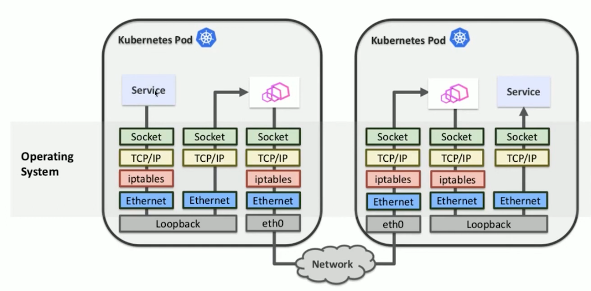
### 跨地域流量管理的挑战
* 采用多活数据中心的网络拓扑，任何生产应用都需要完成跨三个数据中心的部署。
* 为满足单集群的高可用，针对每个数据中心，任何应用都需进行多副本部署，并配置负载均衡。
* 以实现全站微服务化，但为保证高可用，服务之间的调用仍以南北流量为主。
* 针对核心应用，除集群本地负载均衡配置以外，还需配置跨数据中心负载均衡并通过权重控制将 99%的请求转入本地数据中心，将1% 的流量转向跨地域的数据中心。

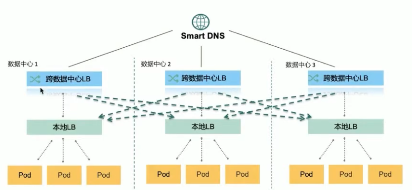

### 规模化带来的挑战(eBay)
* 3主数据中心，20 边缘数据中心 ，100+ Kubernetes 集群
* 规模化运营 Kubernetes 集群
  * 总计100,000物理节点
  * 单集群物理机节点规模高达5,000
* 业务服务全面容器化，单集群
  * Pod 实例可达 100,000
  * 发布服务 5,000-10000
* 单集群多环境支持
  * 功能测试、集成测试、压力测试共用单集群
  * 不同环境需要彼此隔离
* 异构应用
  * 云业务，大数据，搜索服务
  * 多种应用协议
  * 灰度发布
* 日益增长的安全需求
  * 全链路TLS
* 可见性需求
  * 访问日志
  * Tracing

### 多集群部署
* Kubernetes 集群联邦
  * 集群联邦 APIServer 作为用户访问 Kubernetes 集群入
  * 所有 Kubernetes 集群注册至集群联邦
* 可用区
  * 数据中心中具有独立供电制冷设备的故障域
  * 同一可用区有较小网络延迟
  * 同一可用区部署了多个 Kubernetes 集群
* 多集群部署
  * 同一可用区设定一个网关集群
  * 网关集群中部署 Istio Primary
  * 同一可用区的其他集群中部署 Istio Remote
  * 所有集群采用相同 RootCA
  * 相同环境 TrustDomain 相同
* 东西南北流量统一管控
  * 同一可用区的服务调用基于 Sidecar
  * 跨可用区的服务调用基于 Istio Gateway

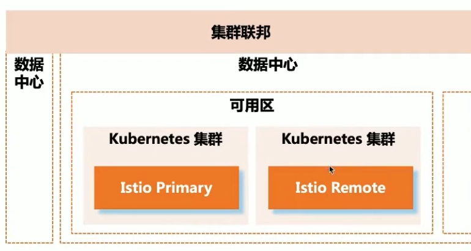

### 入站流量架构 L4 + L7
为不同应用配置独立的网关服务以方便网络隔离。

基于 IPVS/XDP 的 Service Controller :

* 四层网关调度；
* 虚拟IP地址分配；
* 基于 IPIP 协议的转发规则配置；
* 基于 BGP 的IP路由宣告；
* 在Ingress Pod 中配置 Tunnel 设备，并绑定虚拟 IP 地址以卸载IPIP包。


### 单网关集群多环境支持
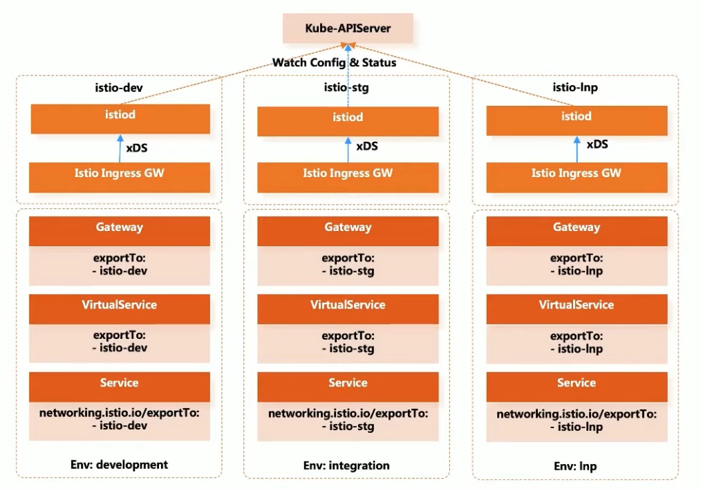

### 应用高可用接入方案
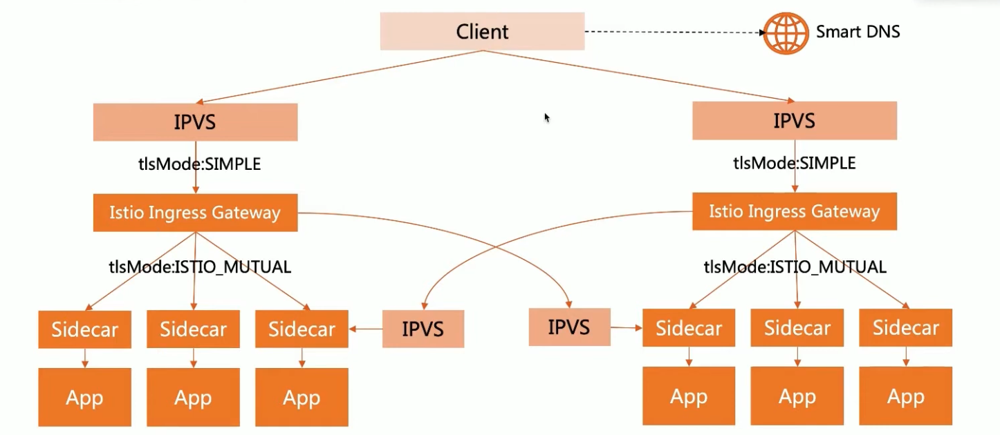


#### 创建WorkloadEntry
#### 定义ServiceEntry
#### 定义基于Locality的流量转发规则

### 应对规模化集群的挑战
Istio xDS 默认发现集群中所有的配置和服务状态，在超大规模集群中，Istiod 或者 Envoy 都承受比较大的压力。

* 集群中的有 10000Service，每个 Service 开放 80 和443 两个端口，Istio 的 CDS 会discover 出20000个Envoy Cluster.
* 如果开启多集群，Istio 还会为每个cluster 创建符合域名规范的集群。
* Istio 还需要发现 remote cluster 中的 Service, Endpoint 和Pod 信息，而这些信息的频繁变更，会导致网络带宽占用和控制面板的压力都很大。

meshConfig 中控制可见性：

* defaultServiceExportTo:
* defaultVirtualServiceExportTo:
* defaultDestinationRuleExportTo:

通过 Istio 对象中的exportT。属性覆盖默认配置。

#### Istiod自身的规模控制

社区新增加了discoverySelector的支持，允许Istiod 只发现添加了特定 label的namespaces 下的Istio 以及 Kubernetes 对象。

但因为 Kubernetes框架的限制，改功能依然要让 Istiod 接收所有配置和状态变更新细，并旦在Istiod 中进行对象过滤。在超大集群规模中，并木降低网络带克占用和 1stiod 的处理压力。

需要继续寻求从 Kubernetes Server 端过滤的解决方案。

### 基于联邦的统一流量模型
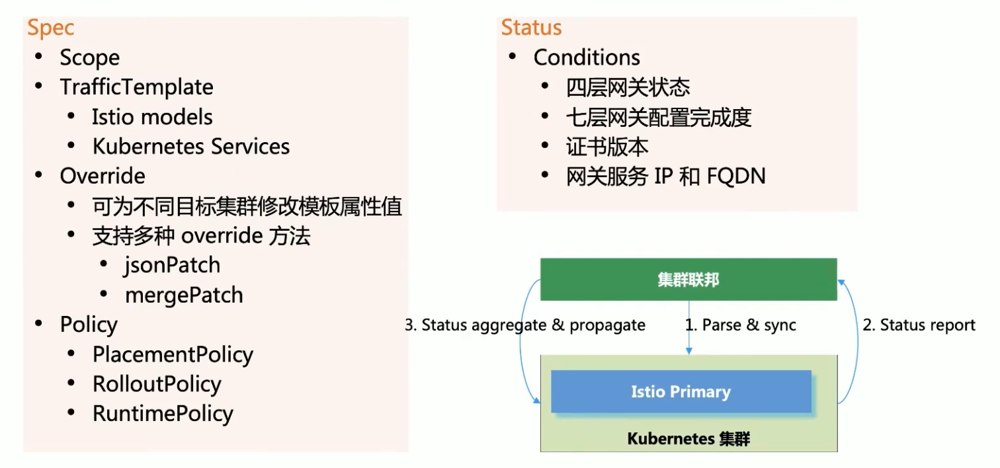

### 统一流量模型 - NameService


### AccessPoint 控制器
PlacementPolicy 控制，用户可以选择目标集群来完成流量配置，甚至可以选择关联的FederatedDeployment 对象，使得 Access Point 自动发现目标集群并完成配置。

完成了状态上报，包括网关虛拟 IP 地址，网关 FQDN，证书安装状态以及版本信息，路由策略是否配置完成等。这补齐了Istio 自身的短板，使得任何部署在 Istio 的应用的网络配置
状态一目了然。

发布策路控制，针对多集群的配置，可实现单集群的灰度发布，并旦能够自动質停发布，管理员验证单个集群的变更正确以后，再继续发布。通过此机制，避免因为全局流量变更产生
的故障。

不同域名的 AccessPoint 可拥有不同的四层网关虛拟IP 地址，以实现基于 IP 地址的四层网
络隔离。

控制器可以基于 AccessPoint 自动创建 WorkloadEntry，并设置 Locality 信息。

### 展望
* 全网构建基于Mesh的流量管理
* 在用户无感知的前提下将南北流量转成东西流量
* 数据平台加速Cilium
