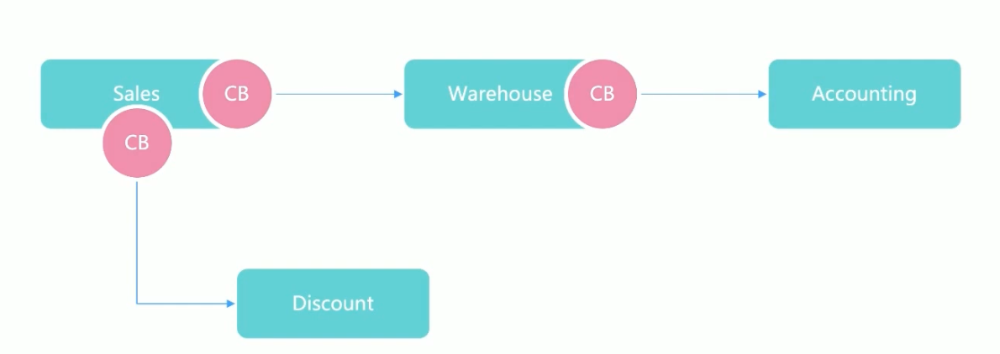
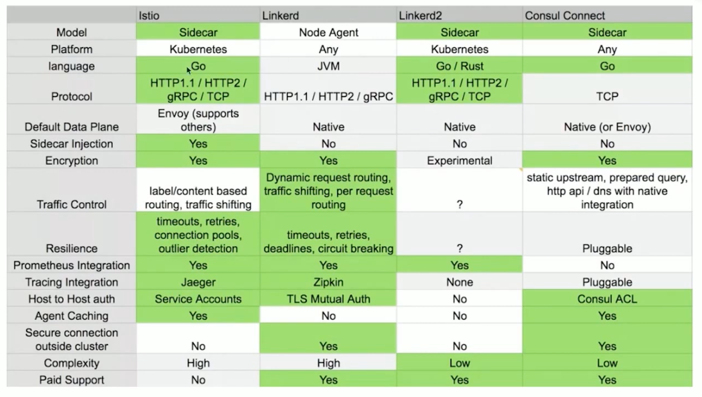
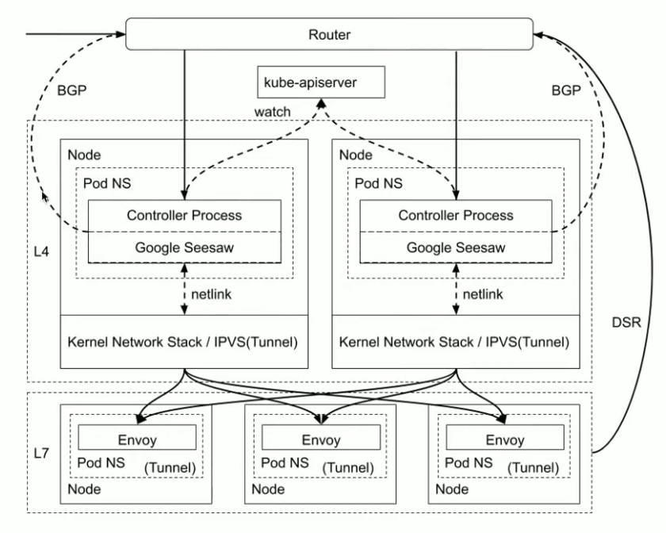

# Istio

  

## 目录

## 微服务架构的演变
### Evolution
#### Monolith架构

#### Microservice架构

#### 典型的微服务业务场景
基于微服务的应用架构：

1. 给服务添加熔断机制，来应对服务故障：

2. 给服务添加负载均衡，服务注册和服务发现：

3. 给服务添加认证和授权：

4. 给服务间调用添加TLS

5. 完整的微服务架构：

## 微服务到服务网格还缺什么
### Sidecar的工作原理
#### 系统边界
服务治理和业务代码结合在一起：

分离服务治理和业务代码后：

#### Sidecar工作原理

Service Mesh:

### Service Mesh
- **适应性**
  - 熔断
  - 重试
  - 超时
  - 负载均衡
  - 失败处理
  - Failover
- **服务发现**
  - 服务注册
  - 服务发现
  - 服务路由
- **安全和访问控制**
  - TLS和证书管理
- **可观察性**
  - metrics
  - monitoring
  - distributed tracing
  - distributed logging
- **部署**
  - 容器
- **通信**
  - HTTP
  - WS
  - gRPC
  - TCP
### 微服务的优劣
#### 优势
- **将基础结构逻辑从业务代码中剥离出来**
  - 分布式tracing
  - 日志
- **自由选择技术栈**
- **帮助业务开发部门只关注业务逻辑**
#### 劣势
- **复杂**
  - 更多的运行实例
- **可能带来额外的网络跳转**
  - 每个服务调用都要经过Sidecar
- **解决了一部分问题，同时要付出代价**
  - 依然要处理复杂路由，类型映射，与外部系统整合等方面的问题
- **不解决业务逻辑或服务整合，服务组合等问题**
### 服务网格可选方案

### 什么是服务网格
服务网格（Service Mesh）这个术语通常用于描述构成这些应用程序的微服务网络及其应用之间的交互。随着规模和复杂性的增长，服务网格越来越难以理解和管理。

它的需求包括：服务发现，负载均衡，故障恢复，指标收集和监控以及通常更加复杂的运维需求，例如A/B测试，金丝雀发布，限流，访问控制和端到端认证等。服务网格提供了一种方法来解决这些问题，而不需要对应用程序进行任何代码更改。

### 为什么要使用Istio
- HTTP，gRPC，WebSockets和TCP流量的自动负载均衡
- 通过丰富的路由规则、重试、故障转移和故障注入、可以对流量行为进行细粒度控制
- 可插入的策略层和配置API，支持访问控制、速率限制和配额
- 对出入集群入口和出口中所有流量的自动度量指标、日志记录和跟踪
- 通过强大的基于身份的验证和授权，在集群中实现安全的服务间通信

### Istio功能概览

#### 流量管理
- **连接**
  - 通过简单的规则配置和流量路由，可以控制服务之间的流量和API调用。Istio简化了断路器、超时和重试等服务级别属性的配置，并且可以轻松设置A/B测试、金丝雀部署和机遇百分比的流量分割的分阶段部署等重要任务。
- **控制**
  - 通过更好地了解流量和开箱即用的故障恢复功能，可以在问题出现之前先发现问题，使调用更可靠，并且使得网络更加健壮。

#### 安全
- **使得开发人员可以专注于应用程序级别的安全性**
  - Istio通过提供一种统一的方法来强制执行策略和配置，从而简化了安全性的复杂性。Istio的安全功能包括服务间的身份验证、授权和加密通信，从而保护服务间的流量，并减轻了应用程序代码中的安全性功能的负担。
- **虽然Istio与平台无关，但将其与Kubernetes（或基础架构）网络策略结合使用，其优势会更大，包括在网络和应用层保护Pod间或服务间通信的能力**

#### 可观察性
Istio生成以下类型的遥测数据，以提供对整个服务网络的可观察性：
- **指标**：Istio基于4个监控的黄金指标（延迟、流量、错误和饱和）生成了一系列服务指标。Istio还为网络控制平面提供了更详细的指标。除此以外还提供了一组默认的基于这些指标的网络监控仪表板。
- **分布式追踪**：Istio通过集成Zipkin和Jaeger，提供了对服务间调用的分布式追踪。Istio还提供了一个默认的基于Kiali的服务拓扑图，以帮助您可视化服务网格。
- **访问日志**：当流量流入网格中的服务时，Istio可以生成每个请求的完整记录，包括源和目标的元数据。此信息使得运维人员能够将服务行为的审查控制到单个工作负载实例的级别。

所有这些功能可以更有效地设置、监控和实施服务上的SLO，快速有效地检测和修复问题。

### Istio架构演进
- **架构演进**
  - 从微服务回归单体架构
  
- **数据平面**
  - 由一组以Sidecar方式部署智能代理（Envoy）组成。
- **控制平面**
  - 负责管理和配置代理来路由流量。

### 设计目标
- **最大透明度**
  - Istio将自身自动注入到服务间所有的网络路径中，运维和开发人员只需要付出很少的代价就可以从中受益。
  - Istio使用Sidecar代理捕获流量，并且在尽可能的地方自动编程网络层，以路由流量通过这些代理，而无需对已部署的应用程序代码进行改动。
  - 在Kubernetes中，代理被注入到Pod中，通过编写iptables规则来捕获流量。注入Sidecar代理到Pod中并且修改路由规则后，Istio就能够调解所有流量。
  - 所有组件和API在设计时都必须考虑性能和规模。
- **增量**
  - 预计最大的需求时扩展策略系统，集成其他策略和控制来源，并将网格行为信号传播到其他系统进行分析。策略运行时支持标准扩展机制以便插入到其他服务中。
- **可移植性**
  - 将基于Istio的服务移植到新环境应该是轻而易举，而使用Istio将一个服务同时部署到多个环境中也是可行的。
- **策略一致性**
  - 在服务间的API调用中，策略的应用使得可以对网格间行为进行全面的控制，但对于无需在API级别表达的资源来说，对资源应用策略也同样重要。
  - 因此，策略系统作为独特的服务来维护，具有自己的API，而不是将其放到代理/Sidecar中，这容许服务根据需要直接与其集成。

## 深入理解数据平面Envoy
### 主流七层代理的比较
|   |  Envoy | Nginx  | HA Proxy  |
|---|---|---|---|
| HTTP/2  | 对HTTP/2有完整支持，同时支持upstream和downstream HTTP/2.  | 从1.9.5开始支持HTTP/2  | HAProxy Enterprise才支持HTTP/2  |
| Rate Limit  | 通过插件支持限流  | 支持基于配置的限流，只支持基于源IP的限流  |   |
| ACL  | 基于插件实现四层ACL  | 基于源/目标地址实现ACL  |   |
| Connection draining  | 支持hot reload, 并且通过share memory实现connection draning的功能 | Nginx Plus收费版支持connection draining  | 支持热启动，但不保证丢弃连接 |

### Enovy的优势
- **性能**
  - 在具备大量特征的同时，Envoy提供极高的吞吐量和低尾部延迟差异，而CPU和RAM消耗却相对较少。
- **可扩展性**
  - Envoy在L4和L7都提供了丰富的可插拔过滤器能力，使得用户可以轻松添加开源版本中没有的功能。
- **API可配置性**
  - Envoy提供了一组可以通过控制平面服务实现的管理API。如果控制平面实现所有的API，则可以使用通过引导配置在整个基础架构上运行Enovy。所有进一步的配置更改通过管理服务器以无缝方式发送传送，因此Enovy从不需要重新启动。这使得Envoy成为通用数据平台，当它与一个足够复杂的控制平面相结合时，会极大地降低整体运维的复杂性。

### Envoy线程模式
- **Envoy采用单进程多线程模式**
  - 主线程负责协调
  - 子线程负责监听过滤和转发
- 当某连接被监听器接收，那么该连接的全部生命周期会与某线程绑定
- Envoy基于非阻塞模式（Epoll）
- **建议Envoy配置的worker数量与Envoy所在的硬件线程数一致**

### Envoy架构

### v1 API的缺点和v2的引入
- **v1 API仅使用JSON/REST，本质上是轮询**，缺点有：
  - 尽管Envoy在内部使用的是JSON模式，但API本身并不是强一致性，而且安全地实现他们的通用服务器也很难。
  - 虽然轮询工作在实践中是很正常的用法，但更强大的控制平面更喜欢streaming API, 当其就绪后，可以将更新推送给每个Envoy。这可以将更新传播时间从30-60s降低到250-500ms，即使在极其庞大的部署中也是如此。
- **v2 API具有以下属性**
  - 新API模式使用protobuf 3指定，并同时以gRPC和REST + JSON/YAML端点实现。
  - 它们被定义在一个名为envoy-api的新的专用源码仓库中。protobuf3的使用意味着这些API是强一致性的，同时仍然通过protobuf3的JSON/YAML表示支持JSON/YAML的变体。
  - 专用仓库的使用意味着项目可以更容易的使用API并用gRPC支持的语言生成存根（实际上，对于希望使用它的用户，我们将继续支持基于REST的JSON/YAML变体）
  - 它们是streaming API，这意味着控制平面可以将更新推送到Envoy，而不是Envoy轮询控制平面。
### xDS - Envoy的发现机制
- 配置
  - **Listener Discovery Service (LDS)**: 用于配置Envoy的监听器
    - **Route Discovery Service (RDS)**: 用于配置Envoy的路由
- 状态
  - **Cluster Discovery Service (CDS)**: 用于配置Envoy的集群
    - **Endpoint Discovery Service (EDS)**: 用于配置Envoy的终端
- 安全
  - **Secret Discovery Service (SDS)**: 用于配置Envoy的TLS证书
- 健康检查
  - **Health Discovery Service (HDS)**: 用于配置Envoy的健康检查
- 协调
  - **Aggregated Discovery Service (ADS)**: 用于配置Envoy的聚合服务

### Envoy的过滤器模式
 

## Istio流量管理
### 流量管理
- Gateway
- VirtualService
- DestinationRule
- ServiceEntry
- WorkloadEntry
- Sidecar
## 跟踪采样

## Istio架构

## 数据平面Envoy

## 控制平面

## 流量管理

## 网络
Service Mesh 涉及的网络栈

## Istio多集群
### 跨地域流量管理的挑战
* 采用多活数据中心的网络拓扑，任何生产应用都需要完成跨三个数据中心的部署。
* 为满足单集群的高可用，针对每个数据中心，任何应用都需进行多副本部署，并配置负载均衡。
* 以实现全站微服务化，但为保证高可用，服务之间的调用仍以南北流量为主。
* 针对核心应用，除集群本地负载均衡配置以外，还需配置跨数据中心负载均衡并通过权重控制将 99%的请求转入本地数据中心，将1% 的流量转向跨地域的数据中心。

### 规模化带来的挑战(eBay)
* 3主数据中心，20 边缘数据中心 ，100+ Kubernetes 集群
* 规模化运营 Kubernetes 集群
  * 总计100,000物理节点
  * 单集群物理机节点规模高达5,000
* 业务服务全面容器化，单集群
  * Pod 实例可达 100,000
  * 发布服务 5,000-10000
* 单集群多环境支持
  * 功能测试、集成测试、压力测试共用单集群
  * 不同环境需要彼此隔离
* 异构应用
  * 云业务，大数据，搜索服务
  * 多种应用协议
  * 灰度发布
* 日益增长的安全需求
  * 全链路TLS
* 可见性需求
  * 访问日志
  * Tracing

### 多集群部署
* Kubernetes 集群联邦
  * 集群联邦 APIServer 作为用户访问 Kubernetes 集群入
  * 所有 Kubernetes 集群注册至集群联邦
* 可用区
  * 数据中心中具有独立供电制冷设备的故障域
  * 同一可用区有较小网络延迟
  * 同一可用区部署了多个 Kubernetes 集群
* 多集群部署
  * 同一可用区设定一个网关集群
  * 网关集群中部署 Istio Primary
  * 同一可用区的其他集群中部署 Istio Remote
  * 所有集群采用相同 RootCA
  * 相同环境 TrustDomain 相同
* 东西南北流量统一管控
  * 同一可用区的服务调用基于 Sidecar
  * 跨可用区的服务调用基于 Istio Gateway

### 入站流量架构 L4 + L7
为不同应用配置独立的网关服务以方便网络隔离。

基于 IPVS/XDP 的 Service Controller :

* 四层网关调度；
* 虚拟IP地址分配；
* 基于 IPIP 协议的转发规则配置；
* 基于 BGP 的IP路由宣告；
* 在Ingress Pod 中配置 Tunnel 设备，并绑定虚拟 IP 地址以卸载IPIP包。

### 单网关集群多环境支持

### 应用高可用接入方案

#### 创建WorkloadEntry
#### 定义ServiceEntry
#### 定义基于Locality的流量转发规则

### 应对规模化集群的挑战
Istio xDS 默认发现集群中所有的配置和服务状态，在超大规模集群中，Istiod 或者 Envoy 都承受比较大的压力。

* 集群中的有 10000Service，每个 Service 开放 80 和443 两个端口，Istio 的 CDS 会discover 出20000个Envoy Cluster.
* 如果开启多集群，Istio 还会为每个cluster 创建符合域名规范的集群。
* Istio 还需要发现 remote cluster 中的 Service, Endpoint 和Pod 信息，而这些信息的频繁变更，会导致网络带宽占用和控制面板的压力都很大。

meshConfig 中控制可见性：

* defaultServiceExportTo:
* defaultVirtualServiceExportTo:
* defaultDestinationRuleExportTo:

通过 Istio 对象中的exportT。属性覆盖默认配置。

#### Istiod自身的规模控制

社区新增加了discoverySelector的支持，允许Istiod 只发现添加了特定 label的namespaces 下的Istio 以及 Kubernetes 对象。

但因为 Kubernetes框架的限制，改功能依然要让 Istiod 接收所有配置和状态变更新细，并旦在Istiod 中进行对象过滤。在超大集群规模中，并木降低网络带克占用和 1stiod 的处理压力。

需要继续寻求从 Kubernetes Server 端过滤的解决方案。

### 基于联邦的统一流量模型

### 统一流量模型 - NameService

### AccessPoint 控制器
PlacementPolicy 控制，用户可以选择目标集群来完成流量配置，甚至可以选择关联的FederatedDeployment 对象，使得 Access Point 自动发现目标集群并完成配置。

完成了状态上报，包括网关虛拟 IP 地址，网关 FQDN，证书安装状态以及版本信息，路由策略是否配置完成等。这补齐了Istio 自身的短板，使得任何部署在 Istio 的应用的网络配置
状态一目了然。

发布策路控制，针对多集群的配置，可实现单集群的灰度发布，并旦能够自动質停发布，管理员验证单个集群的变更正确以后，再继续发布。通过此机制，避免因为全局流量变更产生
的故障。

不同域名的 AccessPoint 可拥有不同的四层网关虛拟IP 地址，以实现基于 IP 地址的四层网
络隔离。

控制器可以基于 AccessPoint 自动创建 WorkloadEntry，并设置 Locality 信息。

### 展望
* 全网构建基于Mesh的流量管理
* 在用户无感知的前提下将南北流量转成东西流量
* 数据平台加速Cilium