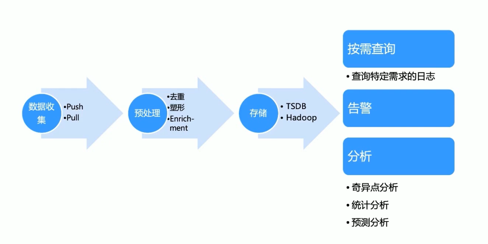
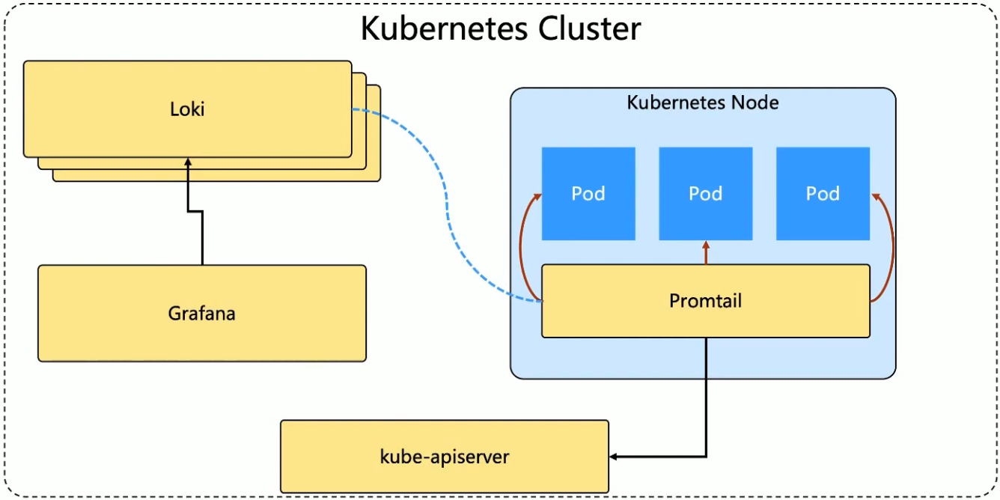
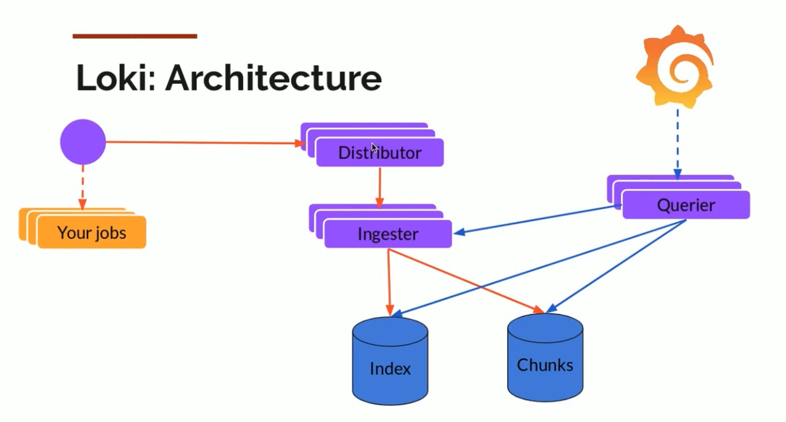

# 日志收集与分析

## 日志系统的价值
* 分布式系统的日志查看比较复杂，因为多对节点的系统，要先找到正确的节点，才能看到想看的日志。日志系统把整个集群的日志汇总在一起，方便查。
* 因为节点上的日志滚动机制，如果有应用打印太多日志，如果没有日志系统，会导致关键日志丢失。
* 日志系统的重要意义在于解決，节点出错导致不可访问，进而丢失日志的情况。

## 常用数据系统构建模式


## 日志收集系统Loki
Grafana Loki是可以组成功能齐全的日志记录堆栈的一组组件。

* 与其他日志记录系统不同，Lok是基于仅索号!有关日志的元数据的想法而构建的：标签。
* 日志数据本身被压缩并存储在对象存储（例如S3或GCS）中的块中，甚至存储在文件系统本地。
* 小素号!和高度压缩的块简化了操作 ，并大大降低了Loki的成本。

### 基于Loki的日志收集系统


#### Loki-stack子系统
* Promtail
  * 将容器日志发送到 Loki 或者 Grafana 服务上的日志收集工具。
  * 发现采集目标以及给日志流添加上 Label，然后发送给 Loki
  * promtail 的服务发现是基于 Prometheus 的服务发现机制实现的，可以查看configmap loki-promtail了解细节
* Loki
    * Loki 是可以水平扩展、高可用以及支持多租户的日志聚合系统
    * 使用和 Prometheus 相同的服务发现机制，将标签添加到日志流中而不是构建全文索引
    * Promtail 接收到的日志和应用的metrics 指标就具有相同的标签集
* Grafana
    * Grafana 是一个用于监控和可视化观测的开源平台 ，支持非常丰富的数据源
    * 在Loki 技术栈中它专门用来展示来自 Prometheus 和 Loki 等数据源的时间序列数据
    * 允许进行查询、可视化、报警等操作，可以用于创建、探索和共享数据 Dashboard

#### Loki的架构

#### Loki的组件
* Distributor
  * 分配器服务负责处理客户端写入的日志。
  * 一旦分配器接收到日志数据，它就会把它们分成若批次，并将它们并行地发送到多个采集器去。
  * 分配器通过gRPC和采集器进行通信。
  * 它们是无状态的，基于一致性哈希，我们可以根据实际需要对他们进行扩缩容。
* Ingester
  * 采集器服务负责将日志数据写入长期存储的后端（DynamoDB、S3、Cassandra 等等）。
  * 采集器会校验采集的日志是否乱序。
  * 采集器验证接收到的日志行是按照时间戳递增的顺序接收的，否则日志行将被拒绝并返回错误。
* Querier
  * 查询器服务负责处理 LogQL 查询语向来评估存储在长期存储中的日志数据。
#### Loki的安装
https://grafana.com/docs/loki/latest/installation/helm/
```zsh
helm repo add grafana https://grafana.github.io/helm-charts
helm repo update
helm upgrade --install loki grafana/loki-stack --set grafana.enabled=true --set prometheus.enabled=true --set prometheus.alertmanager.persistentVolume.enabled=false --set prometheus.server.persistentVolume.enabled=false
```
## 在生产中的问题
存在的问题：
* 利用率低
  * 日志大多数目的是给管理员做问题分析用的，但管理员更多的是登陆到节点或者pod里
做分析，因为日志分析只是整个分析过程中的一部分 ，所以很多时候顺手就把日志看了
* Beats出:现过锁佳文件系统，docker container无法删除的情况
* 与监控系统相比，日志系统的重要度稍低
* 出现过多次因为日志滚动太快币使得日志收集占用太大网络带宽的情況