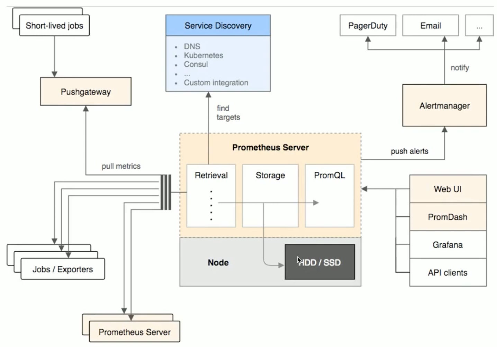

# 监控系统
* ***为什么要监控，监控什么内容***
  * 对自己系统的运行状态了如指掌，有问题及时发现，而不让用户先发现我们系统不能使用。
  * 我们也需要知道我们的服务运行情况。例如，slowsql处于什么水平，平均相应时间超过200ms的占比有多少？

* ***为什么需要监控我们的服务***
  * 需要监控工具提醒我们服务出现故障，比如通过监控服务的负载来决定扩容或缩容。如果机器负载过高，我们需要扩容，如果负载过低，我们需要缩容。如果数据库连接经常维持在一个高位水平，则可以考虑一下是否可以进行拆库处理，优化一下架构。
  * 监控还可以帮助我们进行内部统治，尤其是对安全比较敏感的行业，比如证券银行等，当服务受到攻击时，我们需要分析事件，找到根本原因，识别类似攻击，发现没有发现的被攻击的系统，甚至完成取证等工作。

* ***监控目的***
  * 减少宕机时间
  * 扩展和性能管理
  * 资源计划
  * 识别异常事件
  * 故障排除、分析和预测

## 在kubernetes集群中的监控系统

## 构建支撑生产的监控系统
* Metrics
* Alert
* Assertion

## 经验
* prometheus需要大内存和存储
  * 最初prometheus经常发生OOM kill
  * 在提高指定的资源以后，如果发生crash或重启后，prometheus需要30min+的时间来读取数据进行初始化
* Prometheus是运营生产系统过程中最重要的模块
  * 如果prometheus 宕机，则没有任何数据和告警，管理员两眼一黑，什么都不知道了

## 问题
### 怎么添加指标

### 队指标重命名
