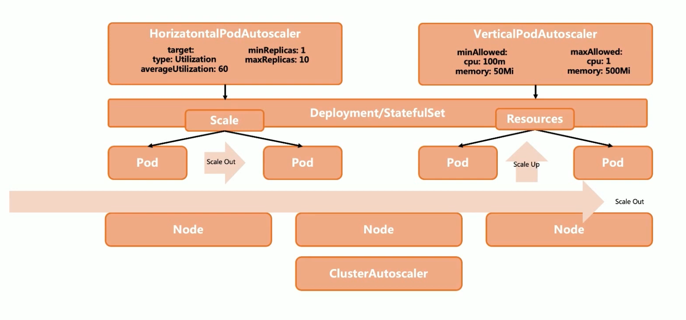
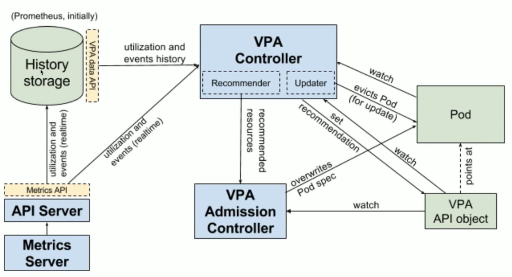
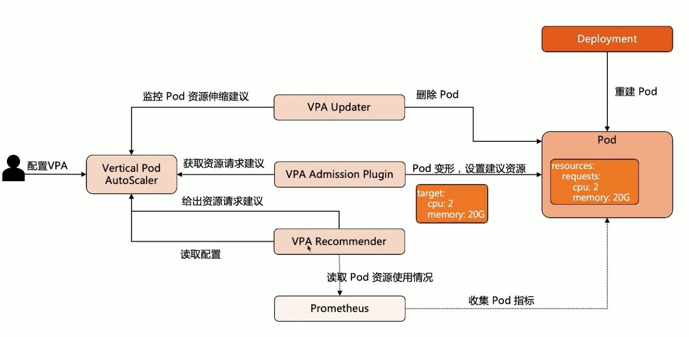
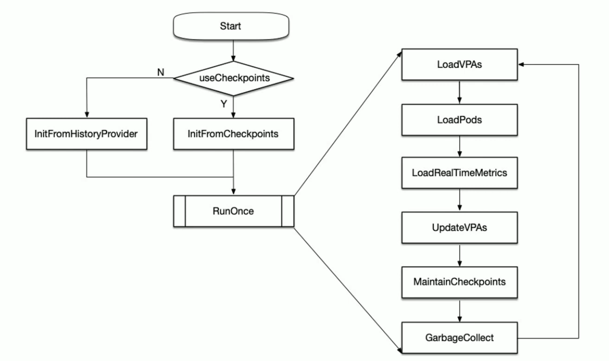

## 云原生的弹性能力

### HPA
HPA ( Horizontal Pod Autoscaler）是Kubernetes 的一种资源对象，能够根据某些指标对在 statefulset、replicaset、deployment 等集合中的 Pod 数量进行横向动态伸缩，使运行在上面的服务对指标的变化有一定的自适应能力。

因节点计算资源固定，当 Pod 调度完成并运行以后，动态调整计算资源变得较为困难，因为横横向扩展具有更大优势，HPA 是扩展应用能力的第一选择。

多个冲突的 HPA 同时创建到同一个应用的时候会有无法预期的行为，因此需要小心维护
HPA 规则。

HPA依赖于 Metrics-Server.

#### HPA支持的指标类型

### VPA
VPA架构图

VPA工作原理

VPA工作主要流程

