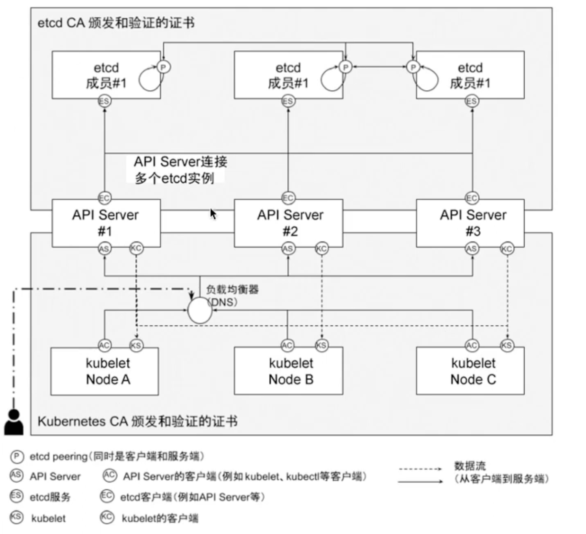
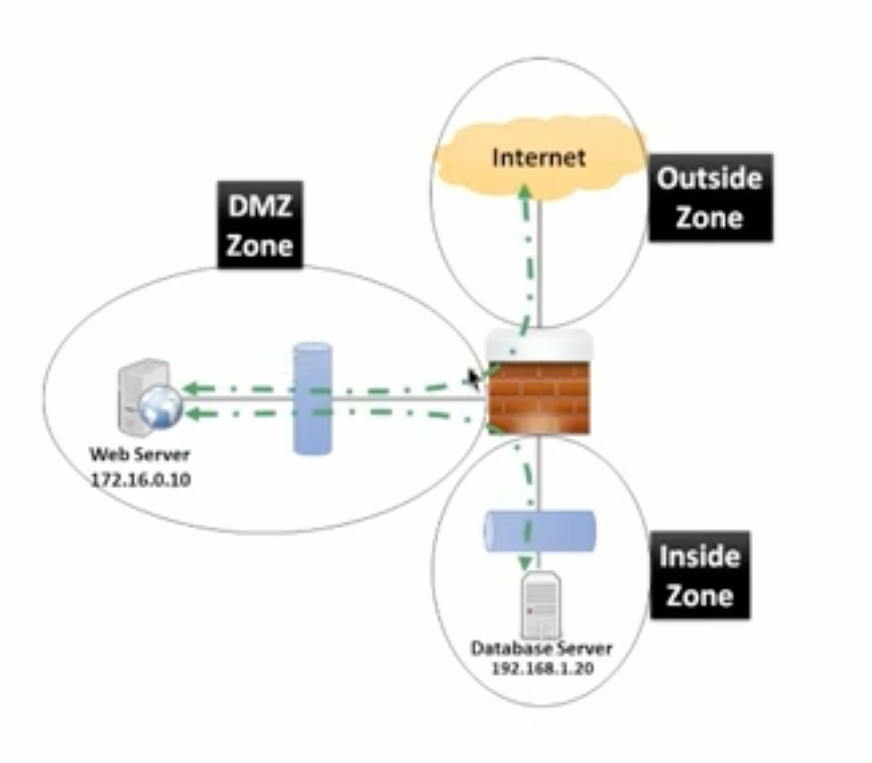
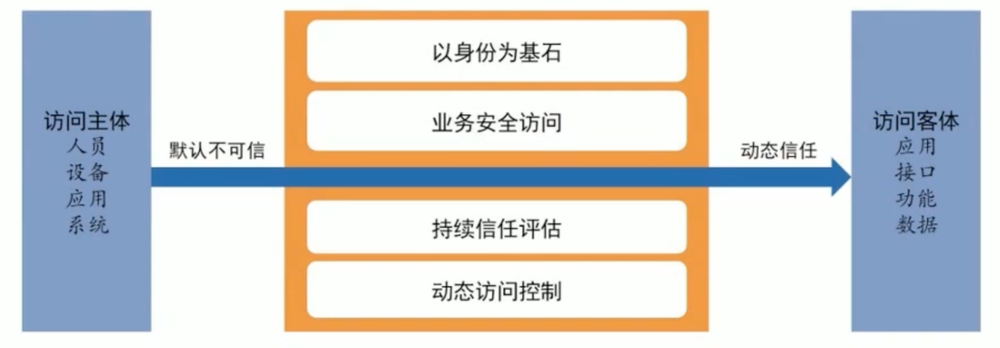
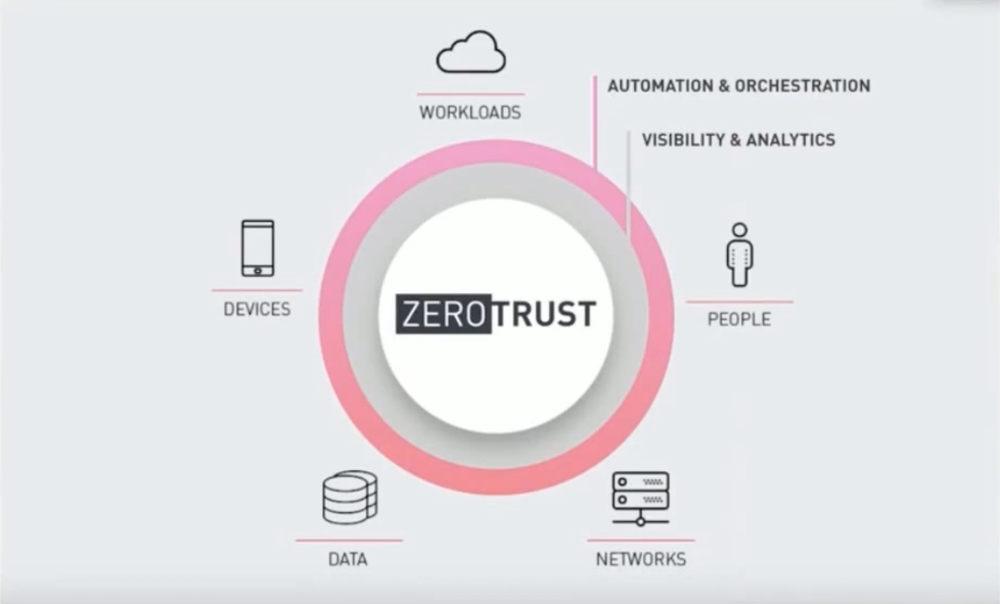
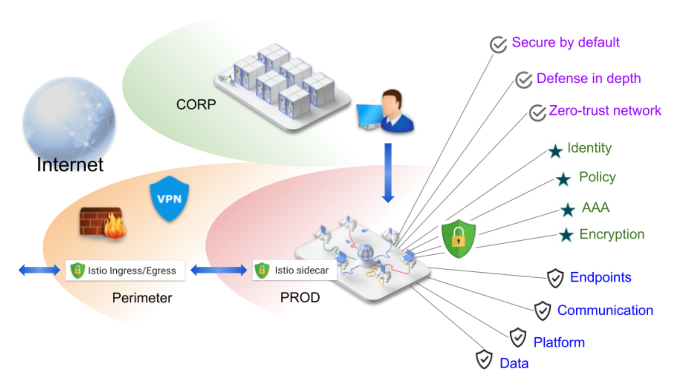
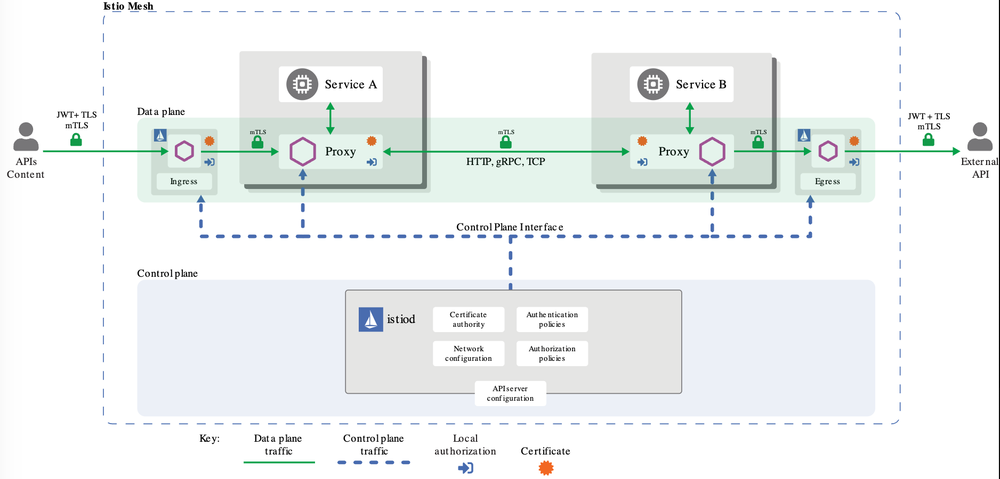
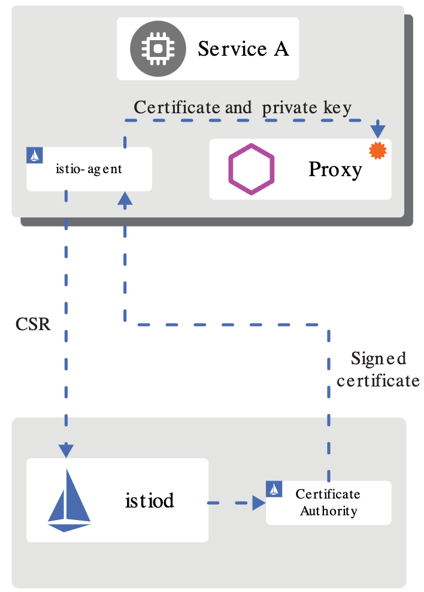
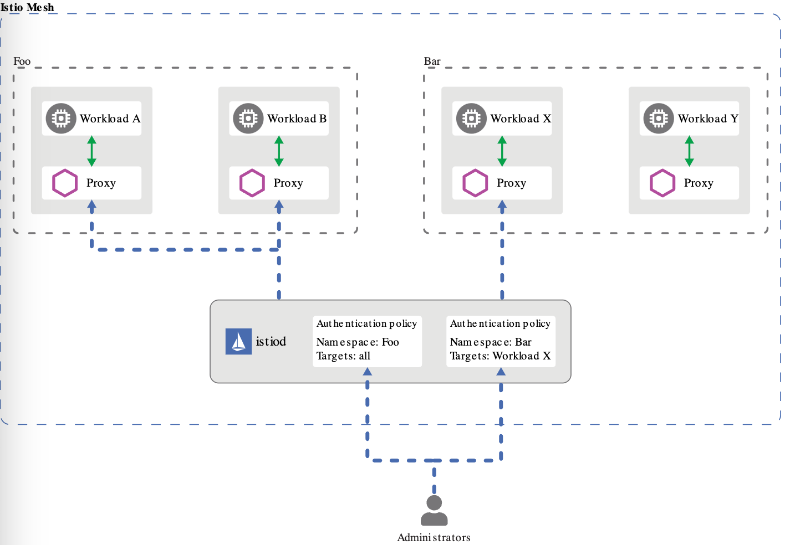

# Security in Kubernetes and Istio

## 目录

- [Security in Kubernetes and Istio](#security-in-kubernetes-and-istio)
  - [目录](#目录)
  - [云原生语境下的安全保证](#云原生语境下的安全保证)
    - [云原生层次模型](#云原生层次模型)
    - [开发环节的安全保证](#开发环节的安全保证)
    - [容器运行时的安全保证](#容器运行时的安全保证)
    - [Kubernetes的安全保证](#kubernetes的安全保证)
    - [集群的安全通信](#集群的安全通信)
    - [控制平面的安全保证](#控制平面的安全保证)
      - [NodeRestriction](#noderestriction)
    - [存储加密](#存储加密)
    - [Security Context](#security-context)
      - [Container-level Security Context](#container-level-security-context)
      - [Pod-level Security Context](#pod-level-security-context)
      - [Pod Security Policy (PSP)](#pod-security-policy-psp)
  - [Taint](#taint)
  - [NetworkPolicy](#networkpolicy)
    - [隔离和非隔离的Pod](#隔离和非隔离的pod)
    - [NetworkPolicy的属性](#networkpolicy的属性)
    - [依托于Calico的NetworkPolicy](#依托于calico的networkpolicy)
      - [理解Calico的防火墙规则](#理解calico的防火墙规则)
  - [零信任架构（ZTA）](#零信任架构zta)
    - [传统安全模型](#传统安全模型)
      - [DMZ模式](#dmz模式)
    - [零信任架构 （Zero Trust Architecture, ZTA）](#零信任架构-zero-trust-architecture-zta)
      - [ZTA安全模型](#zta安全模型)
      - [ZTA的三大技术 SIM](#zta的三大技术-sim)
  - [Istio的安全保证](#istio的安全保证)
    - [微服务架构下的安全挑战](#微服务架构下的安全挑战)
    - [Istio安全功能](#istio安全功能)
    - [Istio安全目标](#istio安全目标)
    - [Istio安全架构](#istio安全架构)
    - [Istio身份](#istio身份)
    - [Istio证书管理](#istio证书管理)
    - [认证](#认证)
      - [认证架构](#认证架构)
    - [鉴权](#鉴权)

## 云原生语境下的安全保证

- 安全保证时贯穿软件整个生命周期的各个部分
- 安全和效率有时候是相违背的
- 如何将两者统一起来，提升安全性的同时，保证效率
- 这需要我们将安全思想贯穿到软件开发运维的所有环节

### 云原生层次模型

软件开发的生命周期：开发 -> 分发 -> 部署 -> 运行


### 开发环节的安全保证

- SaaS应用的12-factor原则的一些理念与云原生安全不谋而合
- 传统的安全三元素**CIA (Confidentiality, Integrity, Availability)**，在云原生安全中被充分应用。
  - Confidentiality: 保证数据的机密性
  - Integrity: 保证数据的完整性
  - Availability: 保证数据的可用性
  - Auditability: 保证数据的可审计性（**云原生安全**）
- 基础设施即代码（Infrastructure as Code, IaC）也与云原生的实践紧密相关。
- 这些方法和原则，都强调通过早期集成安全检测，以确保对过程的控制，使其按预期运行。
- 通过早期检测的预防性成本，降低后续的修复出成本，提升了安全的价值。

### 容器运行时的安全保证

### Kubernetes的安全保证

### 集群的安全通信

Kubernetes期望集群中所有的API通信在默认情况下使用TLS加密，大多数安装方法也允许创建所需的证书并且分发到集群组件中。



### 控制平面的安全保证

- 认证
- 授权
- 配额

#### NodeRestriction

### 存储加密

```yaml
apiVersion: v1
kind: EncryptionConfiguration
resources:
  - resources:
    - secrets
    providers:
    - aesgcm:
        keys:
        - name: key1
          secret: Zm9vYmFyYmF6
    - aescbc:
        keys:
        - name: key1
          secret: Zm9vYmFyYmF6
    - kms:
        name: my-kms-provider
        endpoint: https://my-kms-provider.example.com
        cachesize: 100
        timeout: 10s
    - identity: {}
```

### Security Context

Pod定义包含了一个安全上下文，用于描述允许它请求访问某个节点的特定Linux用户、获得特权或访问主机网络，以及允许它在主机节点上不受约束地运行的其他控件。

Pod安全策略可以限制哪些用户或服务账户可以提供的安全上下文设置。例如：Pod的安全策略可以限制卷挂载、特权、主机网络访问、特定的Linux用户或组、以及Linux能力。尤其是hostpath, 这些都是Pod应该控制的一些方面。

一般来说，大多数应用程序需要限制对主机资源的访问，他们可以在不访问主机信息的情况下成功以根进程（UID 0）运行。但是，考虑到与root用户相关的特权，在编写应用程序容器时，应该避免使用root用户。

类似地，希望阻止客户端应用程序逃避其容器的管理员，应该使用限制性的Pod安全策略。

Kubernetes提供了三种配置Security Context的方式:

- Container-level Security Context: 仅应用到指定的容器
- Pod-level Security Context: 应用到Pod中的所有容器以及Pod级别的Volumes
- Pod Security Policy (PSP): 应用到集群内部所有的Pod以及Volumes

#### Container-level Security Context

Container-level Security Context可以在Pod中的每个容器中定义，它会覆盖Pod-level Security Context中定义的值。它仅应用到指定的容器， 并且不会影响Volume, 比如设置容器运行在特权模式下：

```yaml
apiVersion: v1
kind: Pod
metadata:
  name: security-context-demo-2
spec:
  containers:
  - name: sec-ctx-demo-2
    image: gcr.io/google-samples/node-hello:1.0
    securityContext:
      privileged: true
      allowPrivilegeEscalation: false
```

#### Pod-level Security Context

Pod-level Security Context可以在Pod中定义，它会应用到Pod中的所有容器以及Pod级别的Volumes。它不会覆盖Container-level Security Context中定义的值。它应用到Pod中的所有容器， 并且会影响Volume（包括fsGroup和selinuxOptions）。

```yaml
apiVersion: v1
kind: Pod
metadata:
  name: security-context-demo-1
spec:
  securityContext:
    runAsUser: 1000
    fsGroup: 2000
    supplementalGroups: [10001,10002]
    seLinuxOptions:
      level: "s0:c123,c456"
  volumes:
  - name: sec-ctx-vol
    emptyDir: {}
  containers:
  - name: sec-ctx-demo-1
    image: gcr.io/google-samples/node-hello:1.0
    volumeMounts:
    - name: sec-ctx-vol
      mountPath: /data/demo
    securityContext:
      allowPrivilegeEscalation: false
```

#### Pod Security Policy (PSP)

Pod security Policy (PSP) 是集群级的Pod安全策略，自动为集群内的Pod和Volunme设置Security Context.

`PodSecurityPolicySpec` 的定义在 `pkg/apis/policy/types.go` 中。

定义一个PSP：

```yaml
apiVersion: policy/v1beta1
kind: PodSecurityPolicy
metadata:
  name: restricted
spec:
  privileged: false  # Don't allow privileged pods!
  # The rest fills in some required fields.
  seLinux:
    rule: RunAsAny
  supplementalGroups:
    rule: RunAsAny
  runAsUser:
    rule: RunAsAny
  fsGroup:
    rule: RunAsAny
  volumes:
  - '*'
```

> Linux Capabilities: [manual page](https://man7.org/linux/man-pages/man7/capabilities.7.html)

## Taint

可以以租户为粒度，为不同租户的节点增加Taint, 使得节点彼此隔离。

Taint的作用是让租户独占节点，无对应Toleration的Pod将不会被调度到带有Taint的节点上, 从而实现了应用部署的隔离。

使用命令给节点添加一个taint：

```bash
kubectl taint nodes node1 key=value:NoSchedule
```

使用命令给节点删除一个taint：

```bash
kubectl taint nodes node1 key:NoSchedule-
```

在PodSpec中为容器设定tolerations，以允许容器调度到带有特定taint的节点上：

```yaml
tolerations:
- key: "key"
  operator: "Equal"
  value: "value"
  effect: "NoSchedule"
```

```yaml
tolerations:
- key: "key"
  operator: "Exists"
  effect: "NoSchedule"
```

## NetworkPolicy

如果希望在IP地址或端口层面（OSI第三层或第四层）控制网络流量，则你可以考虑为集群中特定应用使用Kubernetes网络策略（NetworkPolicy）。

Pod可以通信的Pod是通过如下三个标识符的组合来识别的：

- 其他被允许的Pods
- 被允许的名字空间
- IP组块

网络策略通过网络插件来实现。要使用网络策略，你必须使用支持NetworkPolicy的网络解决方案。

> 创建一个NetworkPolicy资源对象，而没有控制器来使它生效的话，是没有任何作用的。

### 隔离和非隔离的Pod

默认情况下，Pod是非隔离的，它们接收任何来源的流量。

Pod在被某NetworkPolicy选中时进入被隔离状态。一旦名字空间中有NetworkPolicy选择了特定的Pod, 该Pod会拒绝该NetworkPolicy所不允许的所有连接。

网络策略不会冲突，而是累积的。如果任何一个或多个NetworkPolicy选择了一个Pod，那么该Pod就受限于这些策略的**入站（Ingress）/出站（Egress）规则**。评估的顺序不会影响策略的结果。

为了允许两个Pods之间的网络数据流，Source Pod的出现规则和Destination Pod的入站规则都需要允许该流量。如果Source Pod的出站规则或Destination Pod的入站规则拒绝该流量，那么该流量将被拒绝。

### NetworkPolicy的属性

NetworkPolicy的属性 `NetworkPolicySpec` 定义在 `pkg/apis/networking/types.go` 中。

```go
type NetworkPolicySpec struct {
  // podSelector selects the pods to which this NetworkPolicy object applies.
  // The array of ingress rules is applied to any pods selected by this field.
  // Multiple network policies can select the same set of pods. In this case,
  // the ingress rules for each are combined additively.
  // This field is NOT optional and follows standard label selector semantics.
  // An empty podSelector matches all pods in this namespace.
  PodSelector metav1.LabelSelector  
  // ingress is a list of ingress rules to be applied to the selected pods.
  // Traffic is allowed to a pod if there are no NetworkPolicies selecting the pod
  // (and cluster policy otherwise allows the traffic), OR if the traffic source is
  // the pod's local node, OR if the traffic matches at least one ingress rule
  // across all of the NetworkPolicy objects whose podSelector matches the pod. If
  // this field is empty then this NetworkPolicy does not allow any traffic (and serves
  // solely to ensure that the pods it selects are isolated by default)
  // +optional
  Ingress []NetworkPolicyIngressRule  
  // egress is a list of egress rules to be applied to the selected pods. Outgoing traffic
  // is allowed if there are no NetworkPolicies selecting the pod (and cluster policy
  // otherwise allows the traffic), OR if the traffic matches at least one egress rule
  // across all of the NetworkPolicy objects whose podSelector matches the pod. If
  // this field is empty then this NetworkPolicy limits all outgoing traffic (and serves
  // solely to ensure that the pods it selects are isolated by default).
  // This field is beta-level in 1.8
  // +optional
  Egress []NetworkPolicyEgressRule  
  // policyTypes is a list of rule types that the NetworkPolicy relates to.
  // Valid options are ["Ingress"], ["Egress"], or ["Ingress", "Egress"].
  // If this field is not specified, it will default based on the existence of ingress or egress rules;
  // policies that contain an egress section are assumed to affect egress, and all policies
  // (whether or not they contain an ingress section) are assumed to affect ingress.
  // If you want to write an egress-only policy, you must explicitly specify policyTypes [ "Egress" ].
  // Likewise, if you want to write a policy that specifies that no egress is allowed,
  // you must specify a policyTypes value that include "Egress" (since such a policy would not include
  // an egress section and would otherwise default to just [ "Ingress" ]).
  // This field is beta-level in 1.8
  // +optional
  PolicyTypes []PolicyType
}
```

NetworkPolicy的一般策略：

```yaml
# allow ingress traffic from pods matching the "role=frontend" label, or pods from namespaces matching the "project=myproject" label, or traffic from ip addresses in the range.
apiVersion: networking.k8s.io/v1
kind: NetworkPolicy
metadata:
  name: allow-from-other-namespace
  namespace: default
spec:
  podSelector:
    matchLabels:
      role: db
  policyTypes:
  - Ingress
  - Egress
  ingress:
  - from:
    - ipBlock:
        cidr: 172.17.0.0/16
        except:
        - 172.17.1.0/24
    - namespaceSelector:
        matchLabels:
          project: myproject
    - podSelector:
        matchLabels:
          role: frontend
    ports:
    - protocol: TCP
      port: 6379
  egress:
  - to:
    - ipBlock:
        cidr: 10.0.0.0/24
    ports:
    - protocol: TCP
      port: 5978
```

NetworkPolicy的默认策略：

```yaml
# deny all ingress traffic
apiVersion: networking.k8s.io/v1
kind: NetworkPolicy
metadata:
  name: default-deny-ingress
  namespace: default
spec:
  podSelector: {}
  policyTypes:
  - Ingress
---
# allow all ingress traffic
apiVersion: networking.k8s.io/v1
kind: NetworkPolicy
metadata:
  name: default-allow-ingress
  namespace: default
spec:
  podSelector: {}
  ingress:
  - {}
  policyTypes:
  - Ingress
---
# deny all egress traffic
apiVersion: networking.k8s.io/v1
kind: NetworkPolicy
metadata:
  name: default-deny-egress
  namespace: default
spec:
  podSelector: {}
  policyTypes:
  - Egress
---
# allow all egress traffic
apiVersion: networking.k8s.io/v1
kind: NetworkPolicy
metadata:
  name: default-allow-egress
  namespace: default 
spec:
  podSelector: {}
  egress:
  - {}
  policyTypes:
  - Egress
```

### 依托于Calico的NetworkPolicy

#### 理解Calico的防火墙规则

```bash
# 查看calico-node容器的防火墙规则
$ docker exec -it calico-node iptables-save
```

## 零信任架构（ZTA）

### 传统安全模型

#### DMZ模式

传统的网络安全架构理念是基于边界的安全架构，企业构建网络安全体系时，首先需找安全边界，把网络划夯为外网、内网、DMZ（Demiitarized Zone）区等不同的区域，然后在边界上部署防火墙、入侵检测、WAF 等产品。

这种网络安全架构假设或默认了内网比外网更安全，忽视加强内网安全措施。

不法分子 一旦突破企业的边界安全防护进入内网，会像进入无人之境，将带来产重的后果。

传统的认证，即信任、边界防护、静态访问控制、以网络为中心。



### 零信任架构 （Zero Trust Architecture, ZTA）

随着云计算、大数据、物联网、移动办公等新技术与业务的深度融合，网络安全边界也变得越来越模糊，传统的网络安全架构已经无法满足企业的安全需求。

零信任核心原则：从不信任，始终验证

动态安全架构：

- 以身份为中心
- 以识别、持续认证、动态访问控制、授权、审计以及监控为链条
- 以最小化实时授权为核心
- 以多维信任算法为基础
- 认证达末端

与边界模型的“信任但验证”不同，零信任模型的核心是“从不信任，始终验证”。根据 Evan Gilman 和 Doug Barth 在《零信任网络》一书中的定义，零信任网络建立在五个假设前提下：

- 应该始终假设网络充满威胁
- 外部和内部威胁每时每刻都充斥着网络
- 不能仅仅依靠网路位置来确认信任关系
- 搜有设备、用户、网络流量都应该被认证和授权
- 访问控制策略应该动态地基于尽量多的数据源进行计算和评估



#### ZTA安全模型



#### ZTA的三大技术 SIM

- 软件定义边界 - SDP, Software Defined Perimeter
- 身份识别与访问管理 - IAM, Identity and Access Management
- 微隔离 - MSG, Micro-segmentation

## Istio的安全保证

### 微服务架构下的安全挑战

为了抵御中间人攻击，需要流量加密。

为了提供灵活的服务访问控制，需要双向TLS和细粒度的访问策略。

要确定谁在什么时候做了什么，需要审计工具。

### Istio安全功能

- 身份识别
- 灵活策略
- 透明的TLS加密
- 认证、授权和审计（AAA）工具来保护服务和数据



### Istio安全目标

- 默认安全：应用程序代码和基础设施无需更改。
- 深度防御：与现有安全系统集成以提供多层防御。
- 零信任网路：在不受信任的网络上构建安全解决方案。

### Istio安全架构

- 用于密钥和证书管理的Istio CA。
- 配置API服务器分发给代理：
  - 认证策略
  - 授权策略
- 安全命名信息
- Sidecar和边缘代理作为Policy Enforcement Point（PEP）以保护客户端和服务器之间的通信安全。
- 一组Envoy代理扩展，用于管理遥测和审计。



### Istio身份

身份时任何安全基础架构的基本概念。

在工作负载间通信开始时，双方必须交换包含身份信息的凭证以进行双向验证。

在客户端，根据安全命名信息（SNI）检查服务器的标识，以查看它是否是该服务的授权运行程序。

在服务器端，服务器可以根据授权策略确定客户端可以访问哪些信息，审计谁在什么时间访问了什么，根据他们使用的工作负载向客户收费，并拒绝任何未能支付账单的客户访问工作负载。

Istio身份模型使用 service identity 来确定一个请求源的身份。

**Kubernetes**： Kubernetes的服务账户
**GKE/GCE**：GCP的服务账户
**GCP**：GCP的服务账户
**AWS**：AWS IAM 用户/角色账户
**On-Prem**：自定义服务账户

Istio安全与SPIFFE（Secure Production Identity Framework For Everyone）项目密切相关。

- Istio和SPIFFE共享相同的身份文件：SVID（SPIFFE Verifiable Identity Document）。例如：在Kubernetes中，X.509证书的URI字段格式为`spiffe://<trust-domain>/ns/<namespace>/sa/<serviceaccount>`。这使得Istio服务能够建立和接收来自SPIFFE服务的安全连接。

### Istio证书管理

Istio提供身份时通过 secret discovery service（SDS）来实现的：

- istiod 提供gRPC 服务以接收证书签名请求（CSRs）。
- 当工作负载启动时，Envoy通过 Envoy SDS API向同容器内的istio-agent 发送证书和密钥请求。
- istio-agent收到SDS请求后，创建私钥和CSR，然后将CSR及其凭证发送给istiod进行签名。
- istiod CA验证CSR中携带的凭证，成功验证后签署CSR以生成证书。
- istio-agent通过Envoy SDS API将私钥和从istiod接收到的证书发送给Envoy。
- istio-agent会监控证书的有效期。

> 上述CSR过程会周期性重复，以处理证书和密钥轮换。



### 认证

Istio通过客户端和服务器端Policy Enforcement Points (PEPs)来建立服务到服务的通信通道。PEPs在istio架构中的实现就是Envoy。

Istio提供了两种认证方式：

- Peer authentication：用于服务到服务的认证，以验证进行连接的客户端。Istio提供双向TLS作为传输认证的全栈解决方案，无需更改服务代码即可以启用。这个方案是：
  - 为每个服务提供强大的身份，表示其角色，以实现跨集群和云的互操作性。
  - 保护服务到服务的通信。
  - 提供密钥管理系统，以自动进行密钥和证书的生成、分发和轮换。
- Request authentication: 用于最终用户认证，以验证附加到请求的凭证。Istio使用JSON Web Token(JWT)验证启用请求级认证，并使用自定义认证实现或其他OpenID Connect的认证实现来简化开发体验。
  - [ORY Hydra](https://www.ory.sh/)
  - [Keycloak](https://www.keycloak.org/)
  - [Auth0](https://auth0.com/)
  - [Firebase Auth](https://firebase.google.com/docs/auth/)
  - [Google Auth](https://developers.google.com/identity/protocols/OpenIDConnect)

#### 认证架构



宽容模式（permissive mode）

安全命名

### 鉴权
