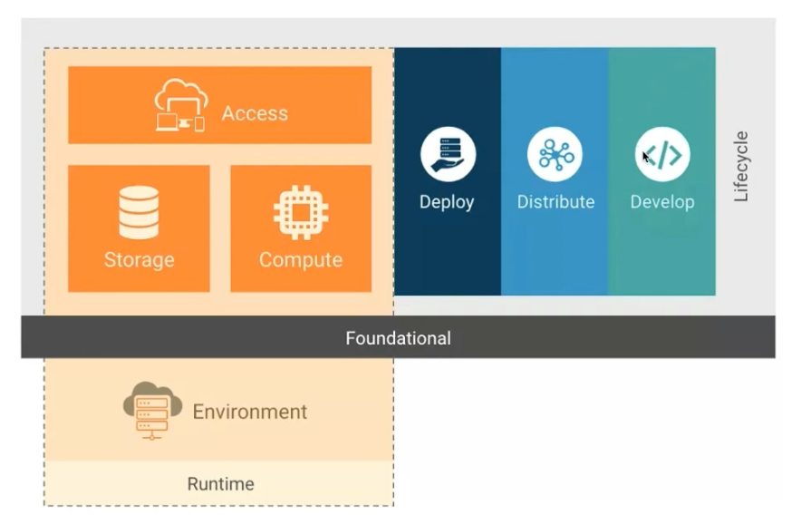

# Security in Kubernetes and Istio

## 云原生语境下的安全保证
- 安全保证时贯穿软件整个生命周期的各个部分
- 安全和效率有时候是相违背的
- 如何将两者统一起来，提升安全性的同时，保证效率
- 这需要我们将安全思想贯穿到软件开发运维的所有环节

## 云原生层次模型
软件开发的生命周期：开发 -> 分发 -> 部署 -> 运行

### 容器运行时的安全保证
### Kubernetes的安全保证

## Taint

## NetworkPolicy
### 依托于Calico的NetworkPolicy

## 零信任架构（ZTA）

## Istio的安全保证
### 认证
### 鉴权